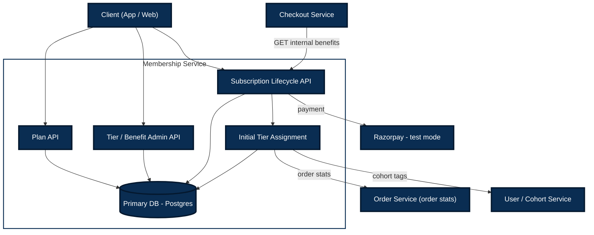

# FirstClub Membership Program — Technical Specification

**Status:** v1 — Draft
**Companion doc:** `requirements.md` (v1, Finalized) — every section here traces back to an Functional Requirements (FR)/Non-Functional Requirements (NFR) from that doc
**Last updated:** 2026-08-13

---

## 1. Architecture Overview

### 1.1 Service boundary

The Membership Program is modeled as a standalone **Membership Service**, exposing REST
APIs to (a) the client apps (web/mobile) and (b) other internal services (Order Service,
Checkout Service). It owns its own datastore and does not directly own Users, Orders, or
Cohorts — those are read via internal APIs from their owning services.



 

> **Diagram note:** `Order Service` and `User/Cohort Service` are called independently by the Membership Service only while assigning the initial Tier at subscription (§4). `Checkout Service` is a *consumer* of this service (calls in), not a dependency it calls out to.

### 1.2 Key architectural decisions (traced to requirements)

| Decision | Why | Traces to |
|---|---|---|
| Tier is computed once at subscription from current Order/Cohort data and stored on Membership | Keeps the first phase simple while assigning the correct tier from a user's existing history. Dynamic re-evaluation is deferred. | FR-7, FR-11 |
| Paid upgrade directly replaces the stored tier; **voluntary tier downgrade is not offered** | The change is immediate and remains until cancellation or expiry. | FR-9 |
| No refund logic anywhere in this service | Simplifies cancel to a pure status change, and is also why voluntary tier downgrade was dropped entirely (see above) | FR-12, Decisions Log #4, #10 |
| Benefits stored as structured rows with a string `type` (not a database enum or hardcoded columns) | New types never require a database migration. Launch validation and consumer behavior support the four initial types; future behavior still needs application work. | FR-3, Assumption 2 |
| Tier-upgrade pricing stored as a matrix table keyed by (plan_id, from_tier, to_tier) | Price varies by both plan and tier-pair | FR-9, Assumption 4 |
| Order count/value and cohort read via API from external services, not duplicated | Single source of truth; Membership Service doesn't own Orders/Cohorts | Assumption 3 |
| One active Membership per user (DB-level uniqueness) | No stacked memberships allowed | Assumption 7 |

### 1.3 Implementation scope: what gets built vs. what gets mocked

For the actual implementation/demo phase, effort is focused entirely on the **Membership Service** itself — the entities, APIs, tier-evaluation engine, and flows defined in this spec. The other systems shown in the §1.1 diagram as external boxes (**Order Service**, **User/Cohort Service**, **Checkout Service**) are **not being built** as part of this work. They will be **mocked** so the Membership Service can be demoed and run end-to-end on its own:

| External dependency | How it's mocked for the demo |
|---|---|
| **Order Service** (`client/order/OrderServiceClientImpl`) | Replace the real HTTP client with a stub/fake implementation (e.g. an in-memory map of `userId → {orderCount, orderValue}`, seeded with test data) returning canned `UserOrderStats`. Same interface (`OrderServiceClient`) as the real one, so swapping in a real implementation later is a one-file change. |
| **User/Cohort Service** (`client/cohort/CohortServiceClientImpl`) | Same approach — a stub returning canned `cohort_tags` per test user, behind the same `CohortServiceClient` interface. |
| **Checkout Service** | Not mocked *inside* this codebase — instead, `GET /internal/benefits/{userId}` (§3.4) is demoed by calling it directly (e.g. via Postman/Swagger UI) to simulate what Checkout would do, since Checkout itself is a separate consumer, not a dependency this service calls. |
| **Razorpay** | Not mocked — Razorpay's own **test mode** (per Assumption 9 / Decisions Log) is used directly, since it's a real, free, sandboxed environment built for exactly this purpose. No fake payment gateway needed. |

**Why this approach, and what it preserves:** because `client/order/` and `client/cohort/` are already isolated behind interfaces (§9.4 — "isolates all outbound calls to other services behind interfaces, so the rest of the codebase never talks to `WebClient` directly"), swapping the mock implementations for real ones later requires touching only those two files — nothing in `evaluation/`, `membership/`, or anywhere else changes. This means the demo is a legitimate, representative run of the real system, not a simplified stand-in — the only thing different is where two small pieces of data (order stats, cohort tags) come from.

**Scope note:** For now, these mocked services are not a concern — no effort goes into making them realistic, resilient, or production-like. They exist purely to unblock a working demo of the Membership Service. Integrating with the real Order Service and Cohort Service is deferred to a later phase, once those services/APIs actually exist.

---

## 2. Data Model

#### `Plan`
Billing plan a user subscribes to.

| Field | Type | Notes |
|---|---|---|
| `id` | UUID (PK) | |
| `name` | string | "Monthly", "Quarterly", "Yearly" |
| `duration_days` | int | e.g. 30, 90, 365 |
| `price` | decimal | |
| `currency` | string | e.g. "INR" |
| `is_active` | boolean | inactive plans hidden from users (FR-1) but preserved for existing subscribers (FR-2) |
| `created_at` / `updated_at` | timestamp | |

*Traces to: FR-1, FR-2*

#### `Tier`
A benefit level. Fixed set at launch (Silver/Gold/Platinum) but modeled as a table, not an enum, so tiers themselves could be added later without a schema change. Also carries its auto-tier-earning criteria directly (merged from a formerly-separate `TierCriteria` table — see design note below).

| Field | Type | Notes |
|---|---|---|
| `id` | UUID (PK) | |
| `name` | string | "Silver", "Gold", "Platinum" |
| `rank` | int | ordering, e.g. Silver=1, Gold=2, Platinum=3 — used to determine "higher/lower" for paid-upgrade validation (target tier must outrank current) |
| `min_order_count` | int, nullable | auto-tier criterion: "more than X orders" |
| `min_order_value_monthly` | decimal, nullable | auto-tier criterion: total order value in a month |
| `cohort_tags` | string[], nullable | auto-tier criterion: matches against user's cohort tags |
| `criteria_match_mode` | enum(`ANY`, `ALL`) | whether meeting any one of the above conditions qualifies, or all must be met |
| `is_active` | boolean | |

*At subscription, the service evaluates all active tiers ordered by rank and assigns the highest-rank tier whose criteria match the user's current stats (see §4).*

> **Design note — merged, not split, for now:** Criteria was originally modeled as a separate `TierCriteria` table (1 tier → many criteria rows) to support multiple independent rule sets per tier (e.g. "10 orders OR VIP cohort" as two separately-evaluable options). Since the requirement as specified is **one rule set per tier**, this is a genuine 1:1 relationship — normalizing it into its own table added a join with no benefit. Merged directly into `Tier` as nullable columns instead. **If multiple alternative rule sets per tier become a real need later, this can be split back out** — it's a non-breaking migration (extract columns into a new table, backfill one row per tier).

#### `Benefit`
A configurable perk definition (admin-managed), independent of any specific tier — a "catalog" of benefit instances.

| Field | Type | Notes |
|---|---|---|
| `id` | UUID (PK) | |
| `type` | varchar/string | At launch, API validation permits `FREE_DELIVERY`, `DISCOUNT_PERCENT`, `EARLY_ACCESS`, and `PRIORITY_SUPPORT`. New types need no schema migration, but must be implemented by each consumer before being accepted and given business effect. |
| `value` | JSON | shape depends on `type` — e.g. `{"min_order_value": 499}` for FREE_DELIVERY, `{"percent": 10}` for DISCOUNT_PERCENT |
| `scope` | JSON, nullable | e.g. `{"category_ids": [...]}` or `{"item_ids": [...]}` — null means unscoped/global |
| `is_active` | boolean | |

#### `TierBenefit`
Join table — which Benefits apply to which Tier, optionally scoped to a specific Plan.

| Field | Type | Notes |
|---|---|---|
| `id` | UUID (PK) | |
| `tier_id` | UUID (FK → Tier) | |
| `benefit_id` | UUID (FK → Benefit) | |
| `plan_id` | UUID (FK → Plan), **nullable** | `NULL` = **base benefit**, applies to this tier regardless of which plan the member is on. A specific value = **additional** benefit, unlocked only when this tier is combined with that specific plan (e.g. Yearly-Gold gets extra perks Monthly-Gold doesn't). |
| `is_active` | boolean | allows disabling a benefit for a tier (or tier+plan combo) without deleting the Benefit definition |

- **Resolution rule:** for a member on `(planId, tierId)`, fetch all active rows where `tier_id = tierId AND (plan_id IS NULL OR plan_id = planId)`. This gives every plan the tier's base benefits, plus any plan-specific extras layered on top.
- This is the **only** place Plan and Tier intersect for entitlement purposes — `Plan` and `Tier` themselves stay two independent, uncoupled entities (mirrors how billing platforms like Stripe keep "what you're billed for" separate from "what you're entitled to" — see tech-spec discussion history).

*Traces to: FR-3, FR-4, FR-5*

#### `TierUpgradePrice`
The pricing matrix for paid tier upgrades (FR-9).

| Field | Type | Notes |
|---|---|---|
| `id` | UUID (PK) | |
| `plan_id` | UUID (FK → Plan) | |
| `from_tier_id` | UUID (FK → Tier) | |
| `to_tier_id` | UUID (FK → Tier) | must have higher `rank` than `from_tier_id` |
| `price` | decimal | |
| `currency` | string | |
| `is_active` | boolean | |

- **Uniqueness constraint:** `(plan_id, from_tier_id, to_tier_id)` — one price per combination.
- **Absence = unavailable.** If no active row exists for a given `(plan_id, from_tier_id, to_tier_id)`, that upgrade path is not offered.

#### `Membership`
The core subscription record for a user.

| Field | Type | Notes |
|---|---|---|
| `id` | UUID (PK) | |
| `user_id` | UUID | FK to external User |
| `plan_id` | UUID (FK → Plan) | |
| `current_tier_id` | UUID (FK → Tier) | tier currently in effect, assigned at subscription or replaced by a paid upgrade |
| `tier_source` | enum(`AUTO`, `PAID_UPGRADE`) | records whether the stored tier was assigned from history or a paid upgrade |
| `status` | enum(`ACTIVE`, `CANCELLED`, `EXPIRED`) | |
| `start_date` | timestamp | |
| `expiry_date` | timestamp | |
| `created_at` / `updated_at` | timestamp | |

- **Uniqueness constraint:** at most one row with `status = ACTIVE` per `user_id` (Assumption 7). Before a subscribe check, the service updates any stale `ACTIVE` row with `expiry_date <= now()` to `EXPIRED`, then performs the active-membership check. This keeps the stored status correct and allows immediate re-subscription after expiry.

*Traces to: FR-7, FR-8, FR-9, FR-11, FR-12, FR-13, FR-14*

#### `MembershipAuditLog`
Append-only log of all Plan/Tier changes, per NFR "Auditability."

| Field | Type | Notes |
|---|---|---|
| `id` | UUID (PK) | |
| `membership_id` | UUID (FK → Membership) | |
| `event_type` | enum(`SUBSCRIBED`, `PLAN_CHANGED`, `TIER_PAID_UPGRADED`, `CANCELLED`, `EXPIRED`) | |
| `before_state` | JSON | |
| `after_state` | JSON | |
| `triggered_by` | enum(`USER`, `SYSTEM`, `ADMIN`) | |
| `created_at` | timestamp | |

#### `PaymentRecord`
Tracks Razorpay payment attempts against a Membership, primarily for idempotency (see §6) and financial traceability. One `Membership` can have multiple `PaymentRecord`s over its lifetime (initial subscribe, later a plan-change upgrade, later a tier upgrade).

| Field | Type | Notes |
|---|---|---|
| `id` | UUID (PK) | |
| `membership_id` | UUID (FK → Membership), nullable | null until the Membership exists (e.g. during initial `subscribe`, before confirm) |
| `action_type` | enum(`SUBSCRIBE`, `PLAN_CHANGE`, `TIER_UPGRADE`) | which flow created this payment |
| `razorpay_order_id` | string | |
| `razorpay_payment_id` | string, nullable | populated on confirm |
| `amount` | decimal | |
| `currency` | string | |
| `status` | enum(`CREATED`, `CONFIRMED`, `FAILED`) | |
| `created_at` / `updated_at` | timestamp | |

- **Uniqueness constraint:** `razorpay_payment_id` — this is the idempotency guarantee referenced in §6 and §9.4: a confirm request retried with the same `razorpay_payment_id` is a no-op (existing record returned), never a duplicate mutation.

> **Deferred:** Redis tier caching and dynamic tier re-evaluation are not part of this phase. They can be added later without changing the `Membership` API, using `current_tier_id` as the current source of truth.

---

## 3. API Design

All endpoints are prefixed `/api/v1`. User-facing endpoints require an authenticated user
session; Admin endpoints require an authenticated admin role. Internal endpoints are
callable only by other trusted internal services (e.g. Checkout).

### 3.0 How `userId` reaches the service (auth model)

This applies to every endpoint below and isn't repeated per-endpoint:

- **User-facing endpoints** (`/membership/*`, `/plans`, `/tiers`): the client sends a bearer token (JWT) obtained at login. Spring Security's auth filter validates it and extracts `userId` from the token claims into the security context. Controllers read it via `@AuthenticationPrincipal` — **`userId` is never a query param, path param, or request body field on these endpoints.** A user can only ever act on their own Membership; there is no "act on behalf of another user" path here.
- **Admin endpoints** (`/admin/*`): same JWT-based auth, but the token must carry an admin role/scope, checked via Spring Security method/role-based authorization.
- **Internal, service-to-service endpoints** (`/internal/*`, e.g. `GET /internal/benefits/{userId}`): these ARE called with `userId` as an explicit path param, because the caller (Checkout Service) is asking on behalf of whichever user is checking out. The caller itself is authenticated as a **trusted service** (internal API key, mTLS, or a service-level JWT) — not as that user. This endpoint must never be reachable from a public/client-facing network path — only from other backend services.

### 3.1 Plans

| Method | Path | Purpose | Traces to |
|---|---|---|---|
| GET | `/plans` | List all active plans, with price/duration/benefit summary | FR-1, FR-6 |
| POST | `/admin/plans` | Create a plan | FR-2 |
| PATCH | `/admin/plans/{planId}` | Edit a plan (price, duration, active status) | FR-2 |
| DELETE | `/admin/plans/{planId}` | Disable a plan (soft-delete, sets `is_active=false`) | FR-2 |

**`GET /plans` response example:**
```json
{
  "plans": [
    {
      "id": "plan_monthly",
      "name": "Monthly",
      "durationDays": 30,
      "price": 199,
      "currency": "INR"
    }
  ]
}
```

### 3.2 Tiers & Benefits

| Method | Path | Purpose | Traces to |
|---|---|---|---|
| GET | `/tiers` | List all tiers with their current benefit configuration | FR-6 |
| GET | `/membership/benefits` | Get the caller's current tier + benefits | FR-4 |
| POST | `/admin/tiers` | Create a tier (name, rank, and its criteria fields — `minOrderCount`, `minOrderValueMonthly`, `cohortTags`, `criteriaMatchMode` — all live directly on the Tier payload, since criteria is a 1:1 property of a tier, not a separate resource) | FR-3, FR-11 |
| PATCH | `/admin/tiers/{tierId}` | Edit a tier, including its criteria fields | FR-3, FR-11 |
| POST | `/admin/tiers/{tierId}/benefits` | Attach a Benefit to a Tier | FR-3 |
| PATCH | `/admin/tiers/{tierId}/benefits/{tierBenefitId}` | Enable/disable/edit a tier's benefit | FR-3 |
| POST | `/admin/benefits` | Create a new Benefit definition (`type`, `value`, `scope`) | FR-3 |
| PATCH | `/admin/benefits/{benefitId}` | Edit a Benefit definition | FR-3 |
| POST | `/admin/tier-upgrade-prices` | Create a `(plan, fromTier, toTier)` price entry | FR-9 |
| PATCH | `/admin/tier-upgrade-prices/{id}` | Edit/disable a price entry | FR-9 |

### 3.3 Subscription Lifecycle

| Method | Path | Purpose | Traces to |
|---|---|---|---|
| GET | `/membership` | Get caller's current membership (plan, tier, expiry) | FR-13 |
| POST | `/membership/subscribe` | Create a Razorpay order for a plan (step 1 of 2) | FR-7 |
| POST | `/membership/subscribe/confirm` | Verify payment, create the Membership (step 2 of 2) | FR-7 |
| POST | `/membership/change-plan` | Create a Razorpay order for a plan upgrade, `amountPayable` after day-value credit (step 1 of 2) | FR-8 |
| POST | `/membership/change-plan/confirm` | Verify payment, update `plan_id`/`expiry_date` (step 2 of 2) | FR-8 |
| POST | `/membership/upgrade-tier` | Create a Razorpay order for a tier upgrade (step 1 of 2) | FR-9 |
| POST | `/membership/upgrade-tier/confirm` | Verify payment, update `current_tier_id`/`tier_source` (step 2 of 2) | FR-9 |
| POST | `/membership/cancel` | Cancel membership immediately (no payment step — free action) | FR-12 |

> **Pattern:** `subscribe`, `change-plan`, and `upgrade-tier` are all paid actions and follow the identical two-step shape — `POST /membership/{action}` creates a Razorpay order and returns it; `POST /membership/{action}/confirm` verifies the payment signature and applies the resulting state change in one transaction. `cancel` is the only lifecycle action with no payment step.

**`POST /membership/subscribe` request/response:**
```json
// Request
{ "planId": "plan_yearly" }

// Response (payment required first)
{
  "razorpayOrderId": "order_xyz",
  "amount": 1999,
  "currency": "INR",
  "keyId": "rzp_test_xxx"
}
```

**`POST /membership/subscribe/confirm` request/response:**
```json
// Request
{
  "razorpayOrderId": "order_xyz",
  "razorpayPaymentId": "pay_abc",
  "razorpaySignature": "..."
}

// Response
{
  "membershipId": "mem_123",
  "planId": "plan_yearly",
  "tierId": "tier_silver",
  "tierSource": "AUTO",
  "status": "ACTIVE",
  "startDate": "2026-08-13T00:00:00Z",
  "expiryDate": "2027-08-13T00:00:00Z"
}
```

**`POST /membership/change-plan` request/response:**
```json
// Request
{ "newPlanId": "plan_yearly" }

// Response
{
  "razorpayOrderId": "order_xyz",
  "amountPayable": 1400,
  "credit": 599,
  "currency": "INR",
  "keyId": "rzp_test_xxx"
}
```
`change-plan/confirm` follows the same request/response shape as `subscribe/confirm` (payment fields in, updated Membership out) — see §5.6 for the full flow and credit formula.

**`POST /membership/upgrade-tier` request:**
```json
{ "targetTierId": "tier_gold" }
```
`upgrade-tier/confirm` follows the same two-step pattern as subscribe. On confirm, `current_tier_id` is set to `targetTierId` and `tier_source = PAID_UPGRADE`.

> **No `downgrade-tier` endpoint.** Voluntary tier downgrade was deliberately removed from scope because paid upgrade fees are non-refundable. A member who wants fewer benefits cancels (FR-12) or lets their membership lapse (FR-14).

### 3.4 Internal APIs (service-to-service)

| Method | Path | Purpose | Traces to |
|---|---|---|---|
| GET | `/internal/benefits/{userId}` | Called by Checkout Service to fetch a user's currently applicable benefits, to apply at checkout | FR-5 |

> **Note — `plan_id` is not a request parameter, on either this or `GET /membership/benefits`.** (`userId` reaches this endpoint as shown in §3.0.) `plan_id` is derived server-side from the caller's active `Membership` row, which also stores `current_tier_id`; neither is supplied by the client.

**`GET /internal/benefits/{userId}` response:**
```json
{
  "hasActiveMembership": true,
  "planId": "plan_yearly",
  "tierId": "tier_gold",
  "benefits": [
    { "type": "FREE_DELIVERY", "value": { "minOrderValue": 0 } },
    { "type": "DISCOUNT_PERCENT", "value": { "percent": 10 }, "scope": { "categoryIds": ["electronics"] } }
  ]
}
```
`planId` is included in the **response** (for the caller's/Checkout's visibility and logging) even though it was never in the **request** — it is read from the Membership row, not accepted as input. If `hasActiveMembership` is `false` (no active Membership, or expired), Checkout applies no membership benefits (FR-5).

---

## 4. Initial Tier Assignment (Subscription Time Only)

This phase computes a Tier only after a successful subscription payment. Read paths (`GET /membership`, `GET /membership/benefits`, and `GET /internal/benefits/{userId}`) use the Tier already stored on the Membership.

### 4.1 `assignInitialTier(userId)` — pseudocode

```
function assignInitialTier(userId):
    stats = fetchUserStats(userId)   # order count, order value (via Order Service API)
    cohort = fetchUserCohort(userId) # via User/Cohort Service API
    return computeTierFromCriteria(stats, cohort)  # highest qualifying tier
```

### 4.2 `computeTierFromCriteria(stats, cohort)`

- Iterate all active Tiers ordered by `rank` descending.
- For each tier, evaluate its own `min_order_count` / `min_order_value_monthly` / `cohort_tags` fields against `stats`/`cohort` using its `criteria_match_mode` (`ANY`/`ALL`).
- Return the **highest-rank** tier whose criteria is satisfied. If none match, default to the lowest-rank active tier (e.g. Silver) as the floor for any active member.

### 4.3 Deferred dynamic upgrades

No scheduled, lazy, or cache-driven re-evaluation runs in this phase. A later phase may add dynamic upgrades after orders change; it is intentionally not designed or built now.

---

## 5. Key Flows

### 5.1 Subscribe to a Plan (FR-7)

Before this flow checks for an active Membership, it updates any stale row for the user where `status = ACTIVE` and `expiry_date <= now()` to `EXPIRED`, and writes an `EXPIRED` audit log. The status is therefore corrected immediately instead of waiting for the scheduler.

1. Client → `POST /membership/subscribe { planId }`.
2. Service validates: no existing `ACTIVE` membership for this user (if one exists → 409, points client to `change-plan`).
3. Service creates a Razorpay Order for the plan's price, returns order details to client.
4. Client completes payment via Razorpay Checkout SDK (test mode).
5. Client → `POST /membership/subscribe/confirm { razorpayOrderId, razorpayPaymentId, razorpaySignature }`.
6. Service verifies signature server-side against Razorpay.
7. On success (in a single DB transaction):
   - Update any stale `ACTIVE` Membership for this user with `expiry_date <= now()` to `EXPIRED`, then confirm that no non-expired active Membership exists. If one exists, do not create a Membership and return `409 Conflict`.
   - Create `Membership` row: `status=ACTIVE`, `start_date=now`, `expiry_date=now+plan.duration_days`, `tier_source=AUTO`.
   - Call `assignInitialTier(userId)` to compute the initial Tier from existing history, then store it as `current_tier_id` with `tier_source=AUTO`.
   - Write `MembershipAuditLog` (`SUBSCRIBED`).
8. Return the created Membership to client.
9. On payment verification failure: no Membership created, return 402 with reason.

### 5.2 Checkout-time benefit application (FR-5)

1. Checkout Service, while building the cart total, calls `GET /internal/benefits/{userId}`.
2. Membership Service loads the user's active `Membership` row (source of `planId` and saved `currentTierId`). Neither value is supplied by the caller — both are derived from server-side state.
3. If no active membership → `{ hasActiveMembership: false }`, Checkout applies nothing.
4. If active → fetch that tier's active `TierBenefit`s **for the member's plan** (`tier_id = tierId AND (plan_id IS NULL OR plan_id = planId)`), apply `scope` filtering, return benefit list.
5. Checkout applies FREE_DELIVERY / DISCOUNT_PERCENT to eligible line items per the returned scope; EARLY_ACCESS/PRIORITY_SUPPORT are entitlement flags read by their respective features, not by Checkout.

### 5.3 Paid Tier Upgrade (FR-9)

1. Client → `POST /membership/upgrade-tier { targetTierId }`.
2. Service validates: active membership exists; `targetTierId.rank > currentTier.rank`; a `TierUpgradePrice` row exists and is active for `(membership.plan_id, currentTier, targetTier)` — else 404 "upgrade path unavailable."
3. Service creates Razorpay Order for that price, returns to client.
4. Client completes payment.
5. Client → `POST /membership/upgrade-tier/confirm {...payment fields...}`.
6. On verified success: update `current_tier_id = targetTierId` and `tier_source=PAID_UPGRADE`; write audit log (`TIER_PAID_UPGRADED`). No automatic re-evaluation changes this Tier in the current phase.

> Note: there is no corresponding "downgrade" flow — see §4.3 and requirements.md FR-9 note.

### 5.4 Cancel Membership (FR-12)

1. Client → `POST /membership/cancel`.
2. Service sets `status = CANCELLED` on the active Membership. No refund logic, no proration.
3. No cache action is required in this phase because the saved Membership row is the source of truth.
4. Write audit log (`CANCELLED`).

### 5.5 Expiry (FR-14)

1. Every active-membership lookup uses `status = 'ACTIVE' AND expiry_date > now()`, including checkout benefit resolution and lifecycle actions. This is the immediate expiry enforcement.
2. Scheduled job (frequency: hourly or daily — implementation detail, not user-facing) queries `Membership WHERE status='ACTIVE' AND expiry_date <= now()`.
3. For each: set `status = EXPIRED`; write audit log (`EXPIRED`).
4. No charge attempted (no auto-renew per FR-14). No notification sent (out of scope per Decisions Log #7).

### 5.6 Change Plan — Upgrade Only (FR-8)

1. Client → `POST /membership/change-plan { newPlanId }`.
2. Service validates: active membership exists; `newPlan.price > currentPlan.price` (upgrade-only) — else `400 Bad Request`.
3. Service computes:
   ```
   remainingDays = ceil((membership.expiry_date - now) in days)
   oldDailyRate  = currentPlan.price / currentPlan.duration_days
   credit        = remainingDays * oldDailyRate
   amountPayable = newPlan.price - credit   // always > 0 for a genuine upgrade — see §2/FR-8 note
   ```
4. Service creates a Razorpay Order for `amountPayable`, returns to client (same two-step create-order → confirm pattern as §5.1/§5.3).
5. Client completes payment, calls `POST /membership/change-plan/confirm {...payment fields...}`.
6. On verified success (single transaction): `plan_id = newPlanId`, `expiry_date = now + newPlan.duration_days` (a full fresh duration — remaining old-plan days are converted to price credit only, not carried forward as extra time). `current_tier_id`/`tier_source` are **not** touched — tier is independent of plan. Write audit log (`PLAN_CHANGED`), including `credit` and `amountPayable` in `before_state`/`after_state` for financial traceability.
7. Payment idempotency (§6) applies identically to this flow.

---

## 6. Error Handling & Edge Cases

| Case | Handling |
|---|---|
| Re-subscribe after expiry | Before checking for an active membership, update any stale `ACTIVE` Membership with `expiry_date <= now()` to `EXPIRED`; the user can then subscribe normally. |
| Double-subscribe attempt (user already has a non-expired ACTIVE membership) | `409 Conflict`, response points client to `change-plan` |
| Razorpay webhook/confirm called twice for the same payment (retry) | Idempotency: confirm endpoints check if a Membership/upgrade already exists for that `razorpayPaymentId` before creating a duplicate; safe to return the existing result |
| Payment fails or signature verification fails | No state mutation; `402 Payment Required` with reason; no Membership/upgrade is created |
| Upgrade requested to a tier with no configured price for the user's plan | `404 Not Found` — "upgrade path unavailable" |
| Change-plan requested to a plan with equal or lower price than current | `400 Bad Request` — "downgrade not supported, let current plan expire and resubscribe" |
| Upgrade-tier requested to the same tier the user already has, or a lower tier | `400 Bad Request` |
| Concurrent requests racing to mutate the same Membership (e.g. cancel + upgrade at once) | DB-level optimistic locking (`updated_at`/version column) on `Membership`; losing request gets `409 Conflict`, client retries |
| Order Service or Cohort Service unavailable during initial tier assignment | Do not create the Membership until the initial Tier can be determined; return a retryable service error. These services are not called on normal reads in this phase. |

---

## 7. Open Design Questions (flagged, not yet resolved)

No open design questions remain for this phase.

---

## 8. Traceability Summary

| Requirements Doc Section | Tech Spec Section |
|---|---|
| FR-1, FR-2 (Plans) | §3.1 Plans API |
| FR-3, FR-4, FR-5 (Benefits) | §2 Benefit/TierBenefit entities, §3.2 API, §5.2 Checkout flow |
| FR-6 (Get plans & tiers) | §3.1, §3.2 |
| FR-7 (Subscribe) | §5.1 |
| FR-8 (Change plan) | §5.6 |
| FR-9 (Paid tier upgrade) | §2 TierUpgradePrice, §5.3 |
| FR-11 (Initial tier assignment) | §4 Initial Tier Assignment |
| FR-12 (Cancel) | §5.4 |
| FR-13 (Track membership) | §3.3 `GET /membership` |
| FR-14 (Expiry) | §5.5 |
| NFR: Auditability | §2 MembershipAuditLog |
| NFR: Idempotency | §6 Error Handling |

---

## 9. Application Structure (Java + Spring Boot)

### 9.1 Package strategy: feature-first, not layer-first

Two common approaches exist for a Spring Boot codebase:
- **Package-by-layer** (`controller/`, `service/`, `repository/` at the top level, with all entities dumped inside each) — gets messy fast once you have 6+ domain entities like this project does; a change to "Tier" touches four different top-level folders.
- **Package-by-feature** (each domain concept owns its own vertical slice) — a change to "Tier" logic stays inside `tier/`. This scales better and matches how the data model in §2 is already organized, so it's what's used below.

Within each feature package, the internal layering (`controller → service → repository`) is still enforced — just scoped to that feature, not spread across the whole app.

### 9.2 Folder structure

```
firstclub-membership-service/
├── pom.xml (or build.gradle)
├── src/
│   ├── main/
│   │   ├── java/com/firstclub/membership/
│   │   │   ├── MembershipServiceApplication.java
│   │   │   │
│   │   │   ├── config/
│   │   │   │   ├── SecurityConfig.java          # auth for user/admin/internal routes
│   │   │   │   ├── RazorpayConfig.java          # Razorpay client bean, key/secret binding
│   │   │   │   ├── OpenApiConfig.java           # Swagger/OpenAPI docs
│   │   │   │   ├── WebClientConfig.java         # HTTP clients for Order/Cohort services
│   │   │   │   └── SchedulerConfig.java         # enables @Scheduled for expiry job
│   │   │   │
│   │   │   ├── common/
│   │   │   │   ├── exception/
│   │   │   │   │   ├── GlobalExceptionHandler.java   # @ControllerAdvice, maps to §6 error table
│   │   │   │   │   ├── ResourceNotFoundException.java
│   │   │   │   │   ├── ConflictException.java        # e.g. double-subscribe (409)
│   │   │   │   │   ├── PaymentFailedException.java
│   │   │   │   │   └── InvalidTierTransitionException.java
│   │   │   │   ├── dto/
│   │   │   │   │   ├── ApiResponse.java              # standard response envelope
│   │   │   │   │   └── ErrorResponse.java
│   │   │   │   ├── util/
│   │   │   │   │   ├── DateUtils.java
│   │   │   │   │   └── IdGenerator.java
│   │   │   │   └── enums/
│   │   │   │       ├── MembershipStatus.java         # ACTIVE, CANCELLED, EXPIRED
│   │   │   │       └── TierSource.java                # AUTO, PAID_UPGRADE
│   │   │   │
│   │   │   ├── plan/                                  # traces to FR-1, FR-2 / §2 Plan / §3.1
│   │   │   │   ├── controller/
│   │   │   │   │   ├── PlanController.java            # GET /plans
│   │   │   │   │   └── PlanAdminController.java        # POST/PATCH/DELETE /admin/plans
│   │   │   │   ├── service/
│   │   │   │   │   ├── PlanService.java (interface)
│   │   │   │   │   └── impl/PlanServiceImpl.java
│   │   │   │   ├── repository/PlanRepository.java
│   │   │   │   ├── entity/Plan.java
│   │   │   │   ├── dto/
│   │   │   │   │   ├── PlanResponse.java
│   │   │   │   │   ├── CreatePlanRequest.java
│   │   │   │   │   └── UpdatePlanRequest.java
│   │   │   │   └── mapper/PlanMapper.java              # MapStruct: entity <-> dto
│   │   │   │
│   │   │   ├── tier/                                   # traces to §2 Tier (incl. merged criteria fields) / §3.2
│   │   │   │   ├── controller/
│   │   │   │   │   ├── TierController.java             # GET /tiers
│   │   │   │   │   └── TierAdminController.java        # POST /admin/tiers, PATCH /admin/tiers/{tierId}
│   │   │   │   │                                        # (both incl. criteria fields)
│   │   │   │   ├── service/
│   │   │   │   │   ├── TierService.java
│   │   │   │   │   └── impl/TierServiceImpl.java
│   │   │   │   ├── repository/
│   │   │   │   │   └── TierRepository.java
│   │   │   │   ├── entity/
│   │   │   │   │   └── Tier.java                        # includes min_order_count, min_order_value_monthly,
│   │   │   │   │                                          # cohort_tags, criteria_match_mode
│   │   │   │   ├── dto/
│   │   │   │   │   ├── TierResponse.java
│   │   │   │   │   ├── CreateTierRequest.java
│   │   │   │   │   └── UpdateTierRequest.java
│   │   │   │   └── mapper/TierMapper.java
│   │   │   │
│   │   │   ├── benefit/                                # traces to FR-3, FR-4 / §2 Benefit, TierBenefit
│   │   │   │   ├── controller/
│   │   │   │   │   ├── BenefitController.java          # GET /membership/benefits
│   │   │   │   │   └── BenefitAdminController.java     # POST/PATCH /admin/benefits,
│   │   │   │   │                                        # POST /admin/tiers/{tierId}/benefits,
│   │   │   │   │                                        # PATCH /admin/tiers/{tierId}/benefits/{tierBenefitId}
│   │   │   │   ├── service/
│   │   │   │   │   ├── BenefitService.java
│   │   │   │   │   └── impl/BenefitServiceImpl.java
│   │   │   │   ├── repository/
│   │   │   │   │   ├── BenefitRepository.java
│   │   │   │   │   └── TierBenefitRepository.java
│   │   │   │   ├── entity/
│   │   │   │   │   ├── Benefit.java
│   │   │   │   │   └── TierBenefit.java
│   │   │   │   ├── dto/
│   │   │   │   │   ├── BenefitResponse.java
│   │   │   │   │   ├── CreateBenefitRequest.java
│   │   │   │   │   ├── UpdateBenefitRequest.java
│   │   │   │   │   ├── AttachBenefitToTierRequest.java   # includes optional planId (base vs plan-specific — §2 TierBenefit)
│   │   │   │   │   └── UpdateTierBenefitRequest.java
│   │   │   │   └── mapper/BenefitMapper.java
│   │   │   │
│   │   │   ├── pricing/                                # traces to FR-9 / §2 TierUpgradePrice
│   │   │   │   ├── controller/TierUpgradePriceAdminController.java  # POST/PATCH /admin/tier-upgrade-prices
│   │   │   │   ├── service/
│   │   │   │   │   ├── TierUpgradePriceService.java
│   │   │   │   │   └── impl/TierUpgradePriceServiceImpl.java
│   │   │   │   ├── repository/TierUpgradePriceRepository.java
│   │   │   │   ├── entity/TierUpgradePrice.java
│   │   │   │   └── dto/
│   │   │   │       ├── CreateTierUpgradePriceRequest.java
│   │   │   │       └── UpdateTierUpgradePriceRequest.java
│   │   │   │
│   │   │   ├── membership/                             # traces to FR-7,8,9,11,12,13,14 / §5 flows
│   │   │   │   ├── controller/
│   │   │   │   │   └── MembershipController.java       # GET /membership; subscribe(+/confirm),
│   │   │   │   │                                        # change-plan(+/confirm), upgrade-tier(+/confirm), cancel
│   │   │   │   ├── service/
│   │   │   │   │   ├── MembershipService.java
│   │   │   │   │   └── impl/MembershipServiceImpl.java  # orchestrates payment + tier engine
│   │   │   │   ├── repository/MembershipRepository.java
│   │   │   │   ├── entity/Membership.java
│   │   │   │   ├── dto/
│   │   │   │   │   ├── SubscribeRequest.java
│   │   │   │   │   ├── ChangePlanRequest.java
│   │   │   │   │   ├── ChangePlanQuoteResponse.java       # razorpayOrderId + amountPayable + credit (§3.3)
│   │   │   │   │   ├── UpgradeTierRequest.java
│   │   │   │   │   ├── PaymentConfirmRequest.java         # shared shape for all three /confirm endpoints
│   │   │   │   │   └── MembershipResponse.java
│   │   │   │   ├── mapper/MembershipMapper.java
│   │   │   │   └── validator/
│   │   │   │       └── TierTransitionValidator.java     # rank check for upgrade-tier (target must outrank current)
│   │   │   │
│   │   │   ├── evaluation/                             # traces to FR-11 / §4 Initial Tier Assignment
│   │   │   │   ├── InitialTierAssignmentService.java    # computes Tier once at subscription
│   │   │   │   ├── TierCriteriaMatcher.java             # computeTierFromCriteria(), reads Tier's own fields
│   │   │   │   └── dto/UserStatsSnapshot.java           # order count/value + cohort, assembled
│   │   │   │                                             # from external client calls
│   │   │   │
│   │   │   ├── payment/                                # Razorpay integration, isolated behind
│   │   │   │   ├── RazorpayClientAdapter.java           # thin wrapper over Razorpay SDK
│   │   │   │   ├── service/
│   │   │   │   │   ├── PaymentOrderService.java         # create order
│   │   │   │   │   └── PaymentVerificationService.java  # verify signature (idempotent)
│   │   │   │   ├── dto/
│   │   │   │   │   ├── PaymentOrderResponse.java
│   │   │   │   │   └── PaymentConfirmation.java
│   │   │   │   ├── entity/PaymentRecord.java              # tracks razorpayOrderId/paymentId
│   │   │   │   │                                            # for idempotency (§6)
│   │   │   │   └── repository/PaymentRecordRepository.java
│   │   │   │
│   │   │   ├── audit/                                   # traces to §2 MembershipAuditLog / NFR
│   │   │   │   ├── AuditLogService.java
│   │   │   │   ├── entity/MembershipAuditLog.java
│   │   │   │   ├── repository/MembershipAuditLogRepository.java
│   │   │   │   └── enums/AuditEventType.java
│   │   │   │
│   │   │   ├── client/                                  # outbound calls to OTHER services
│   │   │   │   ├── order/
│   │   │   │   │   ├── OrderServiceClient.java           # interface
│   │   │   │   │   ├── OrderServiceClientImpl.java        # WebClient-based impl
│   │   │   │   │   └── dto/UserOrderStats.java
│   │   │   │   └── cohort/
│   │   │   │       ├── CohortServiceClient.java
│   │   │   │       ├── CohortServiceClientImpl.java
│   │   │   │       └── dto/UserCohortInfo.java
│   │   │   │
│   │   │   ├── internal/                                 # inbound APIs for OTHER internal
│   │   │   │   └── controller/                            # services (e.g. Checkout) to call
│   │   │   │       └── InternalBenefitController.java     # GET /internal/benefits/{userId}
│   │   │   │
│   │   │   └── scheduler/
│   │   │       └── MembershipExpiryJob.java               # traces to FR-14 / §5.5
│   │   │
│   │   └── resources/
│   │       ├── application.yml
│   │       ├── application-local.yml
│   │       ├── application-staging.yml
│   │       ├── application-prod.yml
│   │       └── db/migration/                              # Flyway
│   │           ├── V1__create_plan_table.sql
│   │           ├── V2__create_tier_table.sql
│   │           ├── V3__create_benefit_and_tier_benefit_tables.sql
│   │           ├── V4__create_tier_upgrade_price_table.sql
│   │           ├── V5__create_membership_table.sql
│   │           ├── V6__create_membership_audit_log_table.sql
│   │           └── V7__create_payment_record_table.sql
│   │
│   └── test/
│       └── java/com/firstclub/membership/
│           ├── plan/... (mirrors main structure per feature)
│           ├── membership/
│           │   ├── MembershipServiceImplTest.java          # unit, mocked deps
│           │   └── MembershipControllerIntegrationTest.java # @SpringBootTest + Testcontainers
│           ├── evaluation/
│           │   └── InitialTierAssignmentServiceTest.java    # covers §4 initial assignment
│           └── support/
│               ├── TestcontainersConfig.java                 # Postgres container
│               └── fixtures/                                  # test data builders
```

### 9.3 Verification against §2 (Data Model) and §3 (API Design)

Cross-checking that every entity and endpoint from earlier sections has an explicit home:

| From §2 / §3 | Lives in |
|---|---|
| `Plan` entity + `/plans`, `/admin/plans` | `plan/` |
| `Tier` (incl. merged criteria fields) + `/tiers`, `/admin/tiers` | `tier/` |
| `Benefit`, `TierBenefit` + `/membership/benefits`, `/admin/benefits` | `benefit/` |
| `TierUpgradePrice` + `/admin/tier-upgrade-prices` | `pricing/` |
| `Membership` + `/membership/*` (subscribe, change-plan, upgrade-tier, cancel) | `membership/` |
| `MembershipAuditLog` | `audit/` |
| `PaymentRecord` | `payment/` |
| Initial Tier assignment from Order/Cohort data (§4) | `evaluation/` |
| Razorpay order creation + signature verification (§5.1, §5.3) | `payment/` |
| Order Service / Cohort Service reads (Assumption 3) | `client/order/`, `client/cohort/` |
| `GET /internal/benefits/{userId}` (§3.4) | `internal/` |
| Expiry scheduled job (§5.5) | `scheduler/` |

No entity or endpoint from §2/§3 is missing a package. ✅ (Verified down to the DTO level for §3.2/§3.3 admin and lifecycle endpoints — every POST/PATCH has a corresponding request DTO, not just a controller placeholder.)

### 9.4 Conventions used

- **Interface + `impl/` subpackage for services** — enables mocking in unit tests and keeps a clean seam if a service ever needs multiple implementations.
- **DTOs never leak entities across layers** — controllers only see DTOs; `mapper/` (MapStruct) converts between entity and DTO. Keeps persistence models decoupled from API contracts.
- **`common/` holds only truly cross-cutting code** (exceptions, base response envelope, enums shared by 2+ features) — deliberately kept small so it doesn't become a dumping ground.
- **`client/` isolates all outbound calls to other services** behind interfaces, so the rest of the codebase (and tests) never talks to `WebClient` directly — makes it trivial to mock Order/Cohort service responses in tests.
- **`payment/` isolates Razorpay** behind `RazorpayClientAdapter` — if the payment provider ever changes, only this package is touched.
- **Flyway migrations are numbered and one-concern-per-file**, matching the entity list in §2 in the same order, so schema history reads like a changelog of the data model's evolution.
- **Idempotency (NFR)** is handled by a dedicated `PaymentRecord` entity keyed on `razorpayPaymentId`, checked before any Membership/upgrade mutation — see §6.
- **Tests mirror the main package structure 1:1**, plus a `support/` package for shared Testcontainers config and fixture builders.

### 9.5 What's intentionally *not* over-engineered here

- No separate "domain" vs "infrastructure" hexagonal split — for a service this size, feature packages with clean internal layering give most of the same benefit with less ceremony. Worth revisiting only if the service grows significantly or needs to swap persistence technology.
- No CQRS / separate read-models — this first phase reads the saved Membership tier directly, which keeps the service easy to understand.


