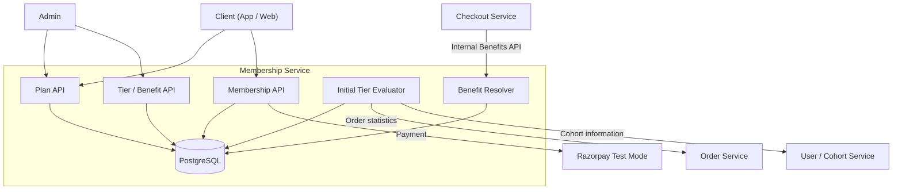

# FirstClub Membership Program — Technical Specification

**Status:** v1 — Finalized  
**Companion doc:** `requirements.md` (v1, Finalized)  
**Last updated:** 2026-08-15

---

## 1. Architecture Overview

### 1.1 Service Boundary

The Membership Program is modeled as a standalone **Membership Service**.

It exposes REST APIs to:

- Client applications.
- Admin applications.
- Trusted internal services such as Checkout.

The Membership Service owns its own datastore and does not directly own Users, Orders, or Cohorts.

Users, Orders, and Cohorts remain owned by their respective services and are accessed through interfaces/clients when required.



### 1.2 Architectural Responsibilities

| Component | Responsibility |
|---|---|
| Plan | Defines the membership product |
| PlanPrice | Defines Monthly / Quarterly / Yearly pricing |
| Tier | Defines tier hierarchy and eligibility rules |
| PlanBenefit | Defines benefits attached to a Plan and optionally a Tier |
| Membership | Represents the user's active subscription |
| Tier Evaluator | Evaluates Tier eligibility during initial subscription |
| Benefit Resolver | Resolves effective benefits for Checkout |
| PaymentRecord | Represents payment state and provider references |
| MembershipAuditLog | Records important Membership lifecycle changes |

### 1.3 External Dependencies

The following systems are outside the Membership Service:

- User Service
- Order Service
- Cohort Service
- Checkout Service
- Razorpay

For the v1 demo, Order and Cohort dependencies may be mocked behind interfaces.

Checkout is a separate consumer and is not implemented inside this service.

Razorpay test mode is used for payment integration.

---

## 2. Key Architectural Decisions

| Decision | Description |
|---|---|
| Plan and PlanPrice are separate | A Plan represents the product; PlanPrice represents its billing options |
| Tier is a table, not an enum | Tiers such as Silver, Gold and Platinum can be added later without a schema change |
| Tier rank represents hierarchy | Rank determines higher/lower Tier and is used for paid Tier upgrades |
| Tier eligibility is JSON | Qualification rules can evolve without repeatedly adding database columns |
| PlanBenefit is the only benefit configuration table | `tier_id = NULL` represents base benefits; non-null `tier_id` represents additional Tier benefits |
| PlanBenefit value is numeric | Discount aggregation becomes deterministic |
| PlanBenefit eligibility is JSON | Benefit applicability rules are extensible and include product/category/item applicability |
| No separate Benefit table | Benefit configuration belongs to a Plan through PlanBenefit |
| No separate TierBenefit table | Tier-specific benefits are represented using PlanBenefit |
| No separate TierUpgradePrice table | One consecutive Tier upgrade price is stored on Plan |
| Plan upgrade uses unused value as credit | The new Plan starts immediately with a fresh duration |
| Tier upgrade does not change subscription dates | Only the current Tier changes |
| PaymentRecord is representation-only | A dedicated payment service/product is out of scope for v1 |
| UserBenefitUsage is deferred | Monthly limits are configuration metadata only in v1 |

---

# 3. Data Model

## 3.1 Plan

A membership product.

Monthly, Quarterly and Yearly are pricing options of the same Plan and are represented through PlanPrice.

| Field | Type | Notes |
|---|---|---|
| `id` | UUID (PK) | |
| `name` | string | Example: `Basic`, `Premium` |
| `rank` | int | Higher rank means a higher Plan |
| `consecutive_tier_upgrade_price` | decimal | Price for one consecutive Tier-rank upgrade within this Plan |
| `is_active` | boolean | Whether the Plan is currently available |
| `created_at` | timestamp | |
| `updated_at` | timestamp | |

### Plan Rank

Plan rank determines Plan upgrade ordering.

```text
Basic    → rank 1
Premium  → rank 2
Elite    → rank 3
```

A Plan upgrade is valid only when:

```text
targetPlan.rank > currentPlan.rank
```

Voluntary Plan downgrade is not supported in v1.

---

## 3.2 PlanPrice

A pricing option belonging to a Plan.

| Field | Type | Notes |
|---|---|---|
| `id` | UUID (PK) | |
| `plan_id` | UUID (FK → Plan) | Owning Plan |
| `billing_period` | enum | `MONTHLY`, `QUARTERLY`, `YEARLY` |
| `duration_days` | int | Example: 30, 90, 365 |
| `price` | decimal | Price for this billing option |
| `currency` | string | Example: `INR` |
| `is_active` | boolean | |
| `created_at` | timestamp | |
| `updated_at` | timestamp | |

### Uniqueness

```text
(plan_id, billing_period)
```

A Plan can therefore have:

```text
Premium
 ├── Monthly
 ├── Quarterly
 └── Yearly
```

Benefits do not change based on the billing period.

Only:

- Price
- Duration

change between PlanPrice records.

---

## 3.3 Tier

A membership level.

Tiers are modeled as a table rather than an enum so new tiers can be added later without a schema change.

Initial tiers:

```text
Silver
Gold
Platinum
```

| Field | Type | Notes |
|---|---|---|
| `id` | UUID (PK) | |
| `name` | string | Example: `Silver`, `Gold`, `Platinum` |
| `rank` | int | Represents Tier hierarchy |
| `eligibility` | JSON, nullable | Rules used by the Tier Evaluator to determine whether a user qualifies |
| `is_active` | boolean | |
| `created_at` | timestamp | |
| `updated_at` | timestamp | |

### Tier Rank

Rank represents hierarchy only.

```text
Silver   → rank 1
Gold     → rank 2
Platinum → rank 3
```

Rank is used for:

- Higher/lower Tier comparison.
- Paid Tier upgrade validation.
- Paid Tier upgrade price calculation.

Rank itself does **not** determine whether a user qualifies for a Tier.

---

### Tier Eligibility

`eligibility` contains the rules used by the Tier Evaluator.

Example:

```json
{
  "matchMode": "ALL",
  "rules": [
    {
      "type": "MIN_ORDER_COUNT",
      "value": 10
    },
    {
      "type": "MIN_MONTHLY_ORDER_VALUE",
      "value": 50000
    }
  ]
}
```

### Eligibility Structure

```text
eligibility
├── matchMode
└── rules[]
      ├── type
      └── value / ids / other rule data
```

`matchMode` supports:

```text
ANY
ALL
```

Example:

```json
{
  "matchMode": "ANY",
  "rules": [
    {
      "type": "MIN_ORDER_COUNT",
      "value": 10
    },
    {
      "type": "COHORT_TAG",
      "value": "VIP"
    }
  ]
}
```

The exact supported rule types are implemented by the Tier Evaluator.

New eligibility rule types can be introduced in application code without adding new columns to the Tier table.

---

## 3.4 PlanBenefit

`PlanBenefit` is the complete benefit configuration for a Plan.

`tier_id` is nullable so the same table represents:

1. Base Plan benefits.
2. Additional benefits for a specific Plan + Tier.

| Field | Type | Notes |
|---|---|---|
| `id` | UUID (PK) | |
| `plan_id` | UUID (FK → Plan), NOT NULL | Every benefit belongs to a Plan |
| `tier_id` | UUID (FK → Tier), nullable | `NULL` = base benefit; non-null = Tier-specific benefit |
| `type` | enum | `FREE_DELIVERY`, `DISCOUNT`, `EARLY_ACCESS`, `PRIORITY_SUPPORT` |
| `value` | decimal, nullable | Numeric benefit value |
| `discount_type` | enum, nullable | `PERCENT` or `FLAT`; applicable to `DISCOUNT` |
| `eligibility` | JSON, nullable | Rules controlling when the benefit applies |
| `monthly_limit` | int, nullable | Monthly entitlement cap; usage tracking is deferred |
| `is_active` | boolean | |
| `created_at` | timestamp | |
| `updated_at` | timestamp | |

### Base Benefit

```text
PlanBenefit
    plan_id = P
    tier_id = NULL
```

represents the default/base Plan benefit.

### Tier Benefit

```text
PlanBenefit
    plan_id = P
    tier_id = T
```

represents an additional benefit for Tier T under Plan P.

The Tier benefit does not replace the base benefit.

---

## 3.5 PlanBenefit Value

`value` is a numeric value rather than JSON.

### Percentage Discount

```text
type = DISCOUNT
discount_type = PERCENT
value = 10
```

means:

```text
10% discount
```

### Flat Discount

```text
type = DISCOUNT
discount_type = FLAT
value = 200
```

means:

```text
₹200 discount
```

### Benefits Without Numeric Value

For benefits such as:

```text
FREE_DELIVERY
EARLY_ACCESS
PRIORITY_SUPPORT
```

`value` may be `NULL`.

We do not force meaningless numeric values into these benefit types.

---

## 3.6 PlanBenefit Eligibility

`PlanBenefit.eligibility` determines when the benefit applies.

It can contain:

- User/action conditions.
- Order conditions.
- Product conditions.
- Category conditions.
- Item conditions.
- Other supported benefit applicability rules.

Example:

```json
{
  "matchMode": "ALL",
  "rules": [
    {
      "type": "MIN_ORDER_VALUE",
      "value": 1000
    },
    {
      "type": "CATEGORY",
      "ids": [
        "electronics"
      ]
    }
  ]
}
```

There is **no separate `scope` field**.

Product/category/item applicability is represented inside `eligibility`.

### Important distinction

```text
Tier.eligibility
    ↓
Can this user qualify for this Tier?

PlanBenefit.eligibility
    ↓
Can this benefit be applied in this situation?
```

Both use the same general JSON rule concept, but they serve different business purposes.

---

## 3.7 PlanBenefit Aggregation

The effective benefits are calculated from:

```text
Base PlanBenefit
        +
Tier-specific PlanBenefit
        ↓
Effective Benefit
```

### Discount Aggregation

For percentage discounts:

```text
10% + 5% = 15%
```

For flat discounts:

```text
₹100 + ₹50 = ₹150
```

Mixing:

```text
PERCENT + FLAT
```

for the same effective discount is invalid in v1.

### Boolean Benefits

For:

```text
EARLY_ACCESS
PRIORITY_SUPPORT
```

the effective value uses OR semantics.

If either the base benefit or Tier benefit provides the capability:

```text
true OR false = true
```

### Free Delivery

`FREE_DELIVERY` has no numeric discount value.

Its applicability is determined by its benefit configuration and `eligibility`.

### User Benefit Usage

`UserBenefitUsage` is intentionally **not implemented in v1**.

`monthly_limit` is configuration/entitlement metadata only.

No per-user consumption counter is maintained.

---

## 3.8 Benefit Uniqueness

Base benefit:

```sql
CREATE UNIQUE INDEX uq_plan_base_benefit
ON plan_benefit(plan_id, type)
WHERE tier_id IS NULL;
```

Tier-specific benefit:

```sql
CREATE UNIQUE INDEX uq_plan_tier_benefit
ON plan_benefit(plan_id, tier_id, type)
WHERE tier_id IS NOT NULL;
```

Therefore:

```text
Same Plan + same type + tier_id NULL
    → only one base benefit

Same Plan + same Tier + same type
    → only one Tier-specific benefit
```

---

## 3.9 Membership

The core subscription record for a user.

| Field | Type | Notes |
|---|---|---|
| `id` | UUID (PK) | |
| `user_id` | UUID | External User identifier |
| `plan_id` | UUID (FK → Plan) | Current Plan |
| `plan_price_id` | UUID (FK → PlanPrice) | Current billing option |
| `current_tier_id` | UUID (FK → Tier), nullable | Current qualified/paid Tier |
| `tier_source` | enum | `AUTO`, `PAID_UPGRADE` |
| `status` | enum | `ACTIVE`, `CANCELLED`, `EXPIRED` |
| `start_date` | timestamp | Start of current subscription term |
| `expiry_date` | timestamp | End of current subscription term |
| `version` | long | Optimistic locking |
| `created_at` | timestamp | |
| `updated_at` | timestamp | |

At most one active Membership is allowed per user.

### Plan Change

When a Plan upgrade succeeds:

```text
old Plan
    ↓
unused value calculated as credit
    ↓
new Plan starts immediately
    ↓
new duration begins from upgrade time
```

The old expiry date is not carried forward.

---

## 3.10 MembershipAuditLog

Append-only audit log for important Membership lifecycle changes.

| Field | Type | Notes |
|---|---|---|
| `id` | UUID (PK) | |
| `membership_id` | UUID (FK → Membership) | |
| `event_type` | enum | `SUBSCRIBED`, `PLAN_CHANGED`, `TIER_PAID_UPGRADED`, `CANCELLED`, `EXPIRED` |
| `before_state` | JSON | State before mutation |
| `after_state` | JSON | State after mutation |
| `triggered_by` | enum | `USER`, `SYSTEM`, `ADMIN` |
| `created_at` | timestamp | |

---

## 3.11 PaymentRecord

`PaymentRecord` is **representation-only**.

It exists to represent payment state, provider references, idempotency and linkage to Membership actions.

A dedicated Payment Service/payment product is out of scope for v1.

| Field | Type | Notes |
|---|---|---|
| `id` | UUID (PK) | |
| `membership_id` | UUID (FK → Membership), nullable | May be null before initial subscription confirmation |
| `action_type` | enum | `SUBSCRIBE`, `PLAN_CHANGE`, `TIER_UPGRADE` |
| `razorpay_order_id` | string | External provider order ID |
| `razorpay_payment_id` | string, nullable | External provider payment ID |
| `amount` | decimal | Amount paid |
| `currency` | string | |
| `status` | enum | `CREATED`, `CONFIRMED`, `FAILED` |
| `created_at` | timestamp | |
| `updated_at` | timestamp | |

`razorpay_payment_id` must be unique when present.

Repeated confirmation of the same payment must not create duplicate Membership or upgrade state.

---

# 4. API Design

All endpoints use:

```text
/api/v1
```

User-facing endpoints obtain `userId` from the authenticated security context.

`userId` must not be accepted from the client for user-facing Membership APIs.

Admin APIs require admin authorization.

Internal APIs require trusted service-to-service authorization.

---

## 4.1 Plan APIs

| Method | Endpoint | Purpose |
|---|---|---|
| GET | `/api/v1/plans` | List active Plans and their active PlanPrices |
| POST | `/api/v1/admin/plans` | Create Plan |
| PATCH | `/api/v1/admin/plans/{planId}` | Update Plan |
| DELETE | `/api/v1/admin/plans/{planId}` | Disable Plan |
| POST | `/api/v1/admin/plans/{planId}/prices` | Create PlanPrice |
| PATCH | `/api/v1/admin/plans/{planId}/prices/{priceId}` | Update PlanPrice |
| DELETE | `/api/v1/admin/plans/{planId}/prices/{priceId}` | Disable PlanPrice |

### Plan Response Example

```json
{
  "id": "plan_premium",
  "name": "Premium",
  "rank": 2,
  "consecutiveTierUpgradePrice": 500,
  "prices": [
    {
      "id": "price_monthly",
      "billingPeriod": "MONTHLY",
      "durationDays": 30,
      "price": 999,
      "currency": "INR"
    },
    {
      "id": "price_quarterly",
      "billingPeriod": "QUARTERLY",
      "durationDays": 90,
      "price": 2699,
      "currency": "INR"
    },
    {
      "id": "price_yearly",
      "billingPeriod": "YEARLY",
      "durationDays": 365,
      "price": 9999,
      "currency": "INR"
    }
  ]
}
```

---

# 5. Tier and Benefit APIs

| Method | Endpoint | Purpose |
|---|---|---|
| GET | `/api/v1/tiers` | List active Tiers |
| POST | `/api/v1/admin/tiers` | Create Tier |
| PATCH | `/api/v1/admin/tiers/{tierId}` | Update Tier |
| GET | `/api/v1/plans/{planId}/benefits` | Get active benefits for a Plan |
| POST | `/api/v1/admin/plans/{planId}/benefits` | Create PlanBenefit |
| PATCH | `/api/v1/admin/plans/{planId}/benefits/{benefitId}` | Update PlanBenefit |
| DELETE | `/api/v1/admin/plans/{planId}/benefits/{benefitId}` | Disable PlanBenefit |

---

## 5.1 Tier Request Example

```json
{
  "name": "Gold",
  "rank": 2,
  "eligibility": {
    "matchMode": "ALL",
    "rules": [
      {
        "type": "MIN_ORDER_COUNT",
        "value": 10
      },
      {
        "type": "MIN_MONTHLY_ORDER_VALUE",
        "value": 50000
      }
    ]
  }
}
```

---

## 5.2 Base PlanBenefit Request

```json
{
  "tierId": null,
  "type": "DISCOUNT",
  "value": 10,
  "discountType": "PERCENT",
  "eligibility": {
    "matchMode": "ALL",
    "rules": [
      {
        "type": "CATEGORY",
        "ids": [
          "electronics"
        ]
      }
    ]
  },
  "monthlyLimit": 5
}
```

---

## 5.3 Tier-specific PlanBenefit Request

```json
{
  "tierId": "tier_gold",
  "type": "DISCOUNT",
  "value": 5,
  "discountType": "PERCENT",
  "eligibility": {
    "matchMode": "ALL",
    "rules": [
      {
        "type": "MIN_ORDER_VALUE",
        "value": 1000
      },
      {
        "type": "CATEGORY",
        "ids": [
          "electronics"
        ]
      }
    ]
  },
  "monthlyLimit": 2
}
```

---

# 6. Membership APIs

| Method | Endpoint | Purpose |
|---|---|---|
| GET | `/api/v1/membership` | Get current Membership |
| POST | `/api/v1/membership/subscribe` | Create subscription payment order |
| POST | `/api/v1/membership/subscribe/confirm` | Confirm payment and create Membership |
| POST | `/api/v1/membership/change-plan` | Create Plan upgrade payment order |
| POST | `/api/v1/membership/change-plan/confirm` | Confirm Plan upgrade |
| POST | `/api/v1/membership/upgrade-tier` | Create Tier upgrade payment order |
| POST | `/api/v1/membership/upgrade-tier/confirm` | Confirm Tier upgrade |
| POST | `/api/v1/membership/cancel` | Cancel Membership |

Paid actions use a two-step:

```text
Create payment order
        ↓
External payment
        ↓
Confirm payment
        ↓
Apply Membership mutation
```

---

# 7. Internal Benefits API

```text
GET /api/v1/internal/benefits/{userId}
```

This endpoint is service-to-service only.

It must not be exposed as a public/client-facing endpoint.

### Resolution Process

1. Find the user's active Membership.
2. Determine the Membership's Plan.
3. Determine the current Tier.
4. Load active base benefits:

```text
plan_id = currentPlan
tier_id IS NULL
```

5. If a Tier exists, load:

```text
plan_id = currentPlan
tier_id = currentTier
```

6. Aggregate base and Tier-specific benefits.
7. Evaluate benefit eligibility against the current checkout context.
8. Return effective benefits.

### Example Response

```json
{
  "hasActiveMembership": true,
  "planId": "plan_premium",
  "tierId": "tier_gold",
  "benefits": [
    {
      "type": "FREE_DELIVERY",
      "value": null,
      "discountType": null,
      "eligibility": null,
      "monthlyLimit": 3
    },
    {
      "type": "DISCOUNT",
      "value": 15,
      "discountType": "PERCENT",
      "eligibility": {
        "matchMode": "ALL",
        "rules": [
          {
            "type": "CATEGORY",
            "ids": [
              "electronics"
            ]
          }
        ]
      },
      "monthlyLimit": null
    }
  ]
}
```

---

# 8. Initial Tier Assignment

Tier evaluation occurs only during subscription in v1.

There is no dynamic Tier re-evaluation after every order.

## 8.1 Assignment Flow

```text
User subscribes
      ↓
Payment confirmed
      ↓
Fetch user order statistics
      ↓
Fetch user cohort information
      ↓
Load active Tiers
      ↓
Evaluate Tier.eligibility
      ↓
Select highest qualifying rank
      ↓
Store current_tier_id
```

## 8.2 `assignInitialTier(userId)`

```text
function assignInitialTier(userId):

    orderStats = orderService.getUserOrderStats(userId)

    cohortInfo = cohortService.getUserCohortInfo(userId)

    return evaluateTiers(orderStats, cohortInfo)
```

## 8.3 `evaluateTiers(...)`

```text
function evaluateTiers(orderStats, cohortInfo):

    tiers = getActiveTiersOrderedByRankDescending()

    for tier in tiers:

        if evaluate(tier.eligibility, orderStats, cohortInfo):
            return tier

    return NULL
```

If no Tier is qualified:

```text
current_tier_id = NULL
```

The user then receives only base Plan benefits.

---

# 9. Plan Upgrade

Only Plan upgrades are supported.

A Plan upgrade requires:

```text
targetPlan.rank > currentPlan.rank
```

## 9.1 Unused Credit

When the user upgrades from one Plan to another, the unused value of the existing Plan is treated as monetary credit.

```text
remainingDays
    = currentExpiryDate - currentTime

dailyRate
    = currentPlanPrice.price / currentPlanPrice.durationDays

unusedCredit
    = dailyRate × remainingDays

amountPayable
    = max(0, newPlanPrice.price - unusedCredit)
```

The exact monetary calculation must use precise decimal arithmetic and the service's currency rounding policy.

## 9.2 Upgrade Timing

Suppose:

```text
Current Plan:
Monthly
₹1,000

Upgrade:
Yearly
₹10,000

Upgrade date:
August 15
```

The new Plan begins immediately:

```text
August 15
     ↓
New Plan starts
     ↓
New Plan duration starts from August 15
```

The old unused value becomes credit toward the new Plan.

The old expiry date is not added to the new Plan's expiry.

---

# 10. Paid Tier Upgrade

Tier upgrades use the Plan-level:

```text
consecutive_tier_upgrade_price
```

There is **no separate TierUpgradePrice table in v1**.

## 10.1 Validation

A paid Tier upgrade requires:

```text
currentTier.rank < targetTier.rank
```

Direct paid upgrade from:

```text
current_tier_id = NULL
```

is not supported in v1.

## 10.2 Price Calculation

```text
rankDifference
    = targetTier.rank - currentTier.rank

upgradePrice
    = rankDifference
      × plan.consecutive_tier_upgrade_price
```

Example:

```text
Silver   → rank 1
Gold     → rank 2
Platinum → rank 3

Plan.consecutive_tier_upgrade_price = ₹500
```

Silver → Gold:

```text
(2 - 1) × ₹500
= ₹500
```

Silver → Platinum:

```text
(3 - 1) × ₹500
= ₹1,000
```

Gold → Platinum:

```text
(3 - 2) × ₹500
= ₹500
```

## 10.3 Tier Upgrade Effect

After successful payment:

```text
current_tier_id
        ↓
targetTierId
```

and:

```text
tier_source = PAID_UPGRADE
```

The following remain unchanged:

```text
plan_id
plan_price_id
start_date
expiry_date
```

Therefore a Tier upgrade changes benefits immediately but does not change the subscription term.

---

# 11. Benefit Resolution

Effective benefits are determined as:

```text
Base Plan Benefits
        +
Current Tier Benefits
        ↓
Effective Benefits
```

### Base benefits

```text
plan_id = P
tier_id = NULL
```

### Tier benefits

```text
plan_id = P
tier_id = currentTier
```

### No Tier

If:

```text
current_tier_id = NULL
```

then only:

```text
tier_id = NULL
```

benefits are returned.

---

# 12. Cancellation

A user can cancel an active Membership.

Cancellation:

- Changes status to `CANCELLED`.
- Creates a MembershipAuditLog entry.
- Does not issue a refund.
- Does not modify historical PaymentRecords.

No voluntary downgrade is performed.

---

# 13. Membership Expiry

An active Membership becomes expired when:

```text
expiry_date <= now
```

The resulting state is:

```text
EXPIRED
```

Expired Memberships do not provide Membership benefits.

A user can subscribe again after expiry.

Before checking for an active Membership, stale active records may be transitioned to `EXPIRED`.

---

# 14. Payment Handling

Payment integration uses Razorpay test mode.

The Membership Service does not become a payment processor.

`PaymentRecord` only represents:

- Payment order.
- Payment reference.
- Amount.
- Currency.
- Status.
- Membership/action linkage.
- Idempotency information.

Repeated payment confirmation must not produce duplicate Membership mutations.

---

# 15. Idempotency

Payment confirmation is idempotent.

The same external payment must never create:

```text
Duplicate Membership
Duplicate Plan Upgrade
Duplicate Tier Upgrade
```

The provider payment reference is unique in `PaymentRecord`.

---

# 16. Auditability

The following Membership events are audited:

```text
SUBSCRIBED
PLAN_CHANGED
TIER_PAID_UPGRADED
CANCELLED
EXPIRED
```

The audit entry records:

```text
before_state
after_state
triggered_by
timestamp
```

---

# 17. Concurrency

Membership mutations must not silently overwrite each other.

Optimistic locking/versioning is used on Membership.

Concurrent mutations resulting in a version conflict return:

```text
409 Conflict
```

---

# 18. Error Handling

The service provides consistent REST error responses through the common exception-handling layer.

Examples:

| Situation | HTTP Status |
|---|---|
| Plan not found | 404 |
| Tier not found | 404 |
| Benefit not found | 404 |
| Invalid benefit configuration | 400 |
| Unsupported downgrade | 400 |
| Invalid Tier upgrade | 400 |
| Duplicate active Membership | 409 |
| Payment verification failure | 402 |
| Concurrent Membership mutation | 409 |

---

# 19. Non-Functional Requirements

## NFR-1 — Idempotency

Payment confirmation must be idempotent.

## NFR-2 — Auditability

Important Membership lifecycle changes must be recorded.

## NFR-3 — Data Integrity

The system shall enforce:

- At most one active Membership per user.
- Unique Plan ranks.
- Unique Tier ranks.
- Valid PlanPrice → Plan relationship.
- Valid PlanBenefit → Plan relationship.
- Valid PlanBenefit → Tier relationship when `tier_id` is non-null.
- Unique base benefit per `(plan_id, type)`.
- Unique Tier benefit per `(plan_id, tier_id, type)`.
- Plan upgrade target must have a higher rank.
- Tier upgrade target must have a higher rank.

## NFR-4 — Concurrency

Optimistic locking is required for Membership state mutations.

## NFR-5 — Error Handling

Consistent REST error responses must be returned.

## NFR-6 — Extensibility

The model must allow:

- New Plans without schema changes.
- New PlanPrice billing periods where supported.
- New Tiers without schema changes.
- New Tier eligibility rule types without adding Tier columns.
- New PlanBenefit eligibility rule types without adding PlanBenefit columns.
- Future per-user benefit usage tracking without changing the meaning of current PlanBenefit configuration.

---

# 20. Explicitly Out of Scope for v1

The following are intentionally not implemented:

- Separate global `Benefit` entity/table.
- Separate `TierBenefit` entity/table.
- Separate `TierUpgradePrice` entity/table.
- `UserBenefitUsage` / per-user benefit consumption tracking.
- Dynamic Tier re-evaluation after every order.
- Scheduled Tier re-evaluation.
- Voluntary Plan downgrade.
- Voluntary Tier downgrade.
- Refund processing.
- Invoice/settlement/accounting system.
- Ownership of Users.
- Ownership of Orders.
- Ownership of Cohorts.
- Building a real Order Service.
- Building a real Cohort Service.
- Building a real Checkout Service.

---

# 21. Application Structure

The application uses a **feature-first package structure**.

```text
src/main/java/com/firstclub/membership/

├── MembershipServiceApplication.java
│
├── common/
│   ├── exception/
│   ├── dto/
│   └── enums/
│
├── plan/
│   ├── controller/
│   │   ├── PlanController.java
│   │   ├── PlanAdminController.java
│   │   └── PlanPriceAdminController.java
│   │
│   ├── service/
│   │   ├── PlanService.java
│   │   ├── PlanPriceService.java
│   │   └── impl/
│   │       ├── PlanServiceImpl.java
│   │       └── PlanPriceServiceImpl.java
│   │
│   ├── repository/
│   │   ├── PlanRepository.java
│   │   └── PlanPriceRepository.java
│   │
│   ├── entity/
│   │   ├── Plan.java
│   │   ├── PlanPrice.java
│   │   └── BillingPeriod.java
│   │
│   ├── dto/
│   │   ├── PlanResponse.java
│   │   ├── PlanPriceResponse.java
│   │   ├── CreatePlanRequest.java
│   │   ├── CreatePlanPriceRequest.java
│   │   ├── UpdatePlanRequest.java
│   │   └── UpdatePlanPriceRequest.java
│   │
│   └── mapper/
│       ├── PlanMapper.java
│       └── PlanPriceMapper.java
│
├── tier/
│   ├── controller/
│   │   ├── TierController.java
│   │   └── TierAdminController.java
│   │
│   ├── service/
│   │   ├── TierService.java
│   │   └── impl/
│   │       └── TierServiceImpl.java
│   │
│   ├── repository/
│   │   └── TierRepository.java
│   │
│   ├── entity/
│   │   └── Tier.java
│   │
│   ├── dto/
│   │   ├── TierResponse.java
│   │   ├── CreateTierRequest.java
│   │   └── UpdateTierRequest.java
│   │
│   └── mapper/
│       └── TierMapper.java
│
├── benefit/
│   ├── controller/
│   │   ├── PlanBenefitController.java
│   │   └── PlanBenefitAdminController.java
│   │
│   ├── service/
│   │   ├── PlanBenefitService.java
│   │   └── impl/
│   │       └── PlanBenefitServiceImpl.java
│   │
│   ├── repository/
│   │   └── PlanBenefitRepository.java
│   │
│   ├── entity/
│   │   └── PlanBenefit.java
│   │
│   ├── dto/
│   │   ├── PlanBenefitResponse.java
│   │   ├── CreatePlanBenefitRequest.java
│   │   └── UpdatePlanBenefitRequest.java
│   │
│   └── mapper/
│       └── PlanBenefitMapper.java
│
├── membership/
│   ├── controller/
│   │   └── MembershipController.java
│   │
│   ├── service/
│   │   ├── MembershipService.java
│   │   └── impl/
│   │       └── MembershipServiceImpl.java
│   │
│   ├── repository/
│   │   └── MembershipRepository.java
│   │
│   ├── entity/
│   │   └── Membership.java
│   │
│   ├── dto/
│   │   └── ...
│   │
│   └── mapper/
│       └── MembershipMapper.java
│
├── evaluation/
│   ├── InitialTierAssignmentService.java
│   ├── TierEligibilityEvaluator.java
│   └── dto/
│       └── UserStatsSnapshot.java
│
├── payment/
│   ├── RazorpayClientAdapter.java
│   ├── service/
│   ├── dto/
│   ├── entity/
│   │   └── PaymentRecord.java
│   └── repository/
│       └── PaymentRecordRepository.java
│
├── audit/
│   ├── AuditLogService.java
│   ├── entity/
│   │   └── MembershipAuditLog.java
│   └── repository/
│       └── MembershipAuditLogRepository.java
│
├── client/
│   ├── order/
│   └── cohort/
│
├── internal/
│   └── controller/
│       └── InternalBenefitController.java
│
└── scheduler/
    └── MembershipExpiryJob.java
```

---

# 22. Coding Conventions

- Package structure is feature-first.
- Controllers exchange DTOs, not persistence entities.
- Services use interface + `impl/`.
- JPA entities use Lombok `@Getter` / `@Setter`.
- DTOs use Java records where appropriate.
- Mapping is explicit and hand-written.
- No MapStruct dependency is required for v1.
- External service communication is isolated behind interfaces.
- Payment integration is isolated behind `RazorpayClientAdapter`.
- JSON eligibility is validated before persistence.
- Membership mutations use optimistic locking.
- Payment confirmation is idempotent.

---

# 23. Database Migration

Because v1 is being developed from scratch, use a single Flyway migration:

```text
src/main/resources/db/migration/
└── V1__create_schema.sql
```

The migration creates:

```text
plan
plan_price
tier
plan_benefit
membership
membership_audit_log
payment_record
```

and all required:

- Primary keys.
- Foreign keys.
- Unique constraints/indexes.
- Membership uniqueness constraints.
- Plan rank uniqueness.
- Tier rank uniqueness.
- PlanBenefit partial unique indexes.

Do not create multiple migrations with the same Flyway version such as:

```text
V1__create_plan.sql
V1__create_tier.sql
V1__create_membership.sql
```

Use one:

```text
V1__create_schema.sql
```

for the initial schema.

---

# 24. Final Consistency Checklist

## Plan

- `Plan` represents the membership product.
- `PlanPrice` represents Monthly / Quarterly / Yearly pricing.
- Plan benefits remain independent of billing period.
- `Plan.rank` determines Plan hierarchy.
- Plan downgrade is not supported.
- `consecutive_tier_upgrade_price` is stored at Plan level.

## PlanPrice

- `PlanPrice` belongs to exactly one Plan.
- Billing periods are `MONTHLY`, `QUARTERLY`, `YEARLY`.
- `(plan_id, billing_period)` is unique.
- Price and duration belong to PlanPrice.

## Tier

- Tier is a table.
- Tier has `name`.
- Tier has `rank`.
- Tier has `eligibility` JSON.
- Tier rank represents hierarchy.
- Tier eligibility determines qualification.
- Tier eligibility is extensible.
- No explicit `min_order_count` column.
- No explicit `min_order_value_monthly` column.
- No explicit `cohort_tags` column.
- No `criteria_match_mode` column.
- No separate `TierCriteria` table.

## PlanBenefit

- `PlanBenefit` is the only benefit configuration entity.
- `plan_id` is mandatory.
- `tier_id` is nullable.
- `tier_id = NULL` means base Plan benefit.
- `tier_id != NULL` means additional Plan + Tier benefit.
- `value` is numeric/nullable.
- `discount_type` is `PERCENT` / `FLAT`.
- `eligibility` is JSON.
- There is no separate `scope` field.
- Product/category/item applicability is represented through `eligibility`.
- `monthly_limit` is configuration metadata.
- `UserBenefitUsage` is not implemented.
- Tier benefits are additive to base benefits.
- Percentage discounts are additive.
- Flat discounts are additive.
- Mixing percentage and flat discounts is invalid.
- Free delivery has no numeric discount value.

## Membership

- Membership stores the current Plan.
- Membership stores the selected PlanPrice.
- Membership stores the current Tier.
- Membership stores Tier source.
- Membership stores subscription dates.
- Only one active Membership exists per user.
- Optimistic locking protects Membership mutations.

## Plan Upgrade

- Only higher-ranked Plans can be selected.
- Unused old-plan value becomes monetary credit.
- New Plan starts immediately.
- New Plan gets a fresh duration.
- Old expiry is not carried forward.

## Tier Upgrade

- Only higher-ranked Tiers can be selected.
- Paid Tier upgrade from `NULL` Tier is unsupported in v1.
- Price is:

```text
(targetTier.rank - currentTier.rank)
× plan.consecutive_tier_upgrade_price
```

- Plan remains unchanged.
- PlanPrice remains unchanged.
- Start date remains unchanged.
- Expiry date remains unchanged.
- Only Tier and Tier source change.

## Payment

- `PaymentRecord` is representation-only.
- Dedicated payment service is out of scope.
- Razorpay test mode is used.
- Payment confirmation is idempotent.

## Scope

The following are not implemented in v1:

- Global Benefit table.
- TierBenefit table.
- TierUpgradePrice table.
- UserBenefitUsage.
- Dynamic Tier re-evaluation.
- Plan downgrade.
- Tier downgrade.
- Refund system.
- Invoice/accounting system.
- User Service.
- Order Service.
- Cohort Service.
- Checkout Service.

---

# 25. Final Status

The v1 technical model is considered finalized with the following core structure:

```text
Plan
 ├── PlanPrice[]
 └── PlanBenefit[]
        │
        └── optional Tier

Tier
 └── eligibility JSON

Membership
 ├── Plan
 ├── PlanPrice
 └── current Tier

PaymentRecord
 └── representation-only payment state

MembershipAuditLog
 └── lifecycle history
```

The central design principle is:

```text
Plan
    → What membership product does the user have?

PlanPrice
    → How much does the membership cost and for how long?

Tier
    → What level has the user qualified for?

Tier.eligibility
    → Does the user qualify for this Tier?

PlanBenefit
    → What benefits does this Plan provide?

PlanBenefit.eligibility
    → When does this benefit apply?

Membership
    → What does this particular user currently have?
```

This is the finalized v1 technical model.
