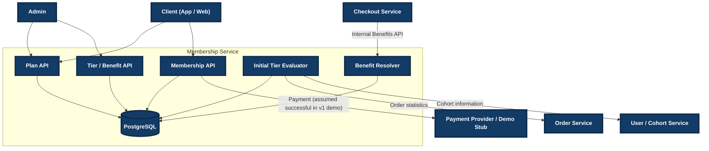

# FirstClub Membership Program — Technical Specification

**Status:** v2 — Finalized  
**Companion doc:** `requirements.md` (Finalized)  
**Last updated:** 2026-08-16

---

## 1. Architecture Overview

### 1.1 Service Boundary

The Membership Program is modeled as a standalone **Membership Service**.

It exposes REST APIs to:

- Client applications.
- Admin applications.
- Trusted internal services such as Checkout.

The Membership Service owns its own PostgreSQL datastore and does not directly own Users, Orders, or Cohorts.

Users, Orders, and Cohorts remain owned by their respective services and are represented in this demo through interfaces/mock providers where required.



> **Payment note:** The provider node is an architectural boundary only. The v1 demo does not implement Razorpay/payment-provider code. Payment is assumed successful and the membership flow continues. The diagram preserves the original architecture/topology while making the payment implementation scope explicit.

### 1.2 Architectural Responsibilities

| Component | Responsibility |
|---|---|
| Plan | Defines the membership product and Plan hierarchy |
| PlanPrice | Defines Monthly / Quarterly / Yearly pricing options for a Plan |
| Tier | Defines Plan-specific Tier hierarchy and eligibility rules |
| PlanBenefit | Defines benefits attached to a Plan and optionally a Tier |
| Membership | Represents the user's active subscription and current Tier |
| TierAssignmentService | Determines the Tier assigned to a Membership |
| TierEligibilityEvaluator | Evaluates whether a user satisfies a Tier's eligibility rules |
| Benefit Resolver | Resolves effective benefits for a Membership |
| MembershipService | Orchestrates Membership lifecycle use cases |
| Domain Services | Own persistence access for their domain and expose domain operations to other services |

### 1.3 External Dependencies

The following systems are outside the Membership Service:

- User Service
- Order Service
- Cohort Service
- Checkout Service

For the v1 demo:

- Order and Cohort data may be mocked behind interfaces.
- Payment is mocked/assumed successful.
- No payment gateway implementation is required.
- Checkout is a consumer of the benefits API and is not implemented inside this service.

---

## 2. Key Architectural Decisions

| Decision | Description |
|---|---|
| Plan and PlanPrice are separate | A Plan represents the product; PlanPrice represents its billing options |
| Tier is a table, not an enum | Tiers such as Silver, Gold and Platinum can be added without a schema change |
| Tier belongs to a Plan | `tier.plan_id` identifies the Plan to which the Tier belongs |
| Tier uniqueness is Plan-scoped | Active Tier name and rank are unique within a Plan; inactive duplicates are allowed |
| Tier rank represents hierarchy | Rank determines higher/lower Tier and is used for paid Tier upgrades |
| Tier eligibility is JSONB | Rules can evolve without repeatedly adding database columns |
| PlanBenefit is the benefit configuration table | `tier_id = NULL` represents base benefits; non-null `tier_id` represents Tier-specific benefits |
| PlanBenefit belongs to the same Plan as its Tier | A Tier-specific benefit must not reference a Tier from another Plan |
| No separate TierBenefit table | Tier-specific benefits are represented using PlanBenefit |
| No separate TierUpgradePrice table | One consecutive Tier upgrade price is stored on Plan |
| PlanPrice determines subscription duration | Monthly/Quarterly/Yearly differ by price and duration |
| Initial Tier evaluation is Plan-scoped | Only active Tiers belonging to the selected Plan are evaluated |
| Plan change re-evaluates Tier | A Membership cannot retain a Tier belonging to its previous Plan |
| Tier upgrade is Plan-scoped | The target Tier must belong to the Membership's current Plan |
| Tier upgrade may skip ranks | Silver → Platinum is valid when Platinum has a higher rank |
| Payment is mocked | No Razorpay/payment-provider implementation is part of v1 |
| Optimistic locking protects Membership mutations | `Membership.version` is used with JPA `@Version` |
| Domain service boundaries are preferred | Cross-domain operations go through the owning domain service rather than directly using another domain's repository |
| UserBenefitUsage is deferred | Monthly limits are configuration metadata only in v1 |

---

# 3. Data Model

## 3.1 Plan

A membership product.

Monthly, Quarterly and Yearly are pricing options of the same Plan and are represented through PlanPrice.

| Field | Type | Notes |
|---|---|---|
| `id` | UUID (PK) | |
| `name` | string | Example: `Basic`, `Premium` |
| `rank` | int | Higher rank means a higher Plan |
| `consecutive_tier_upgrade_price` | decimal | Price for one consecutive Tier-rank upgrade within this Plan |
| `is_active` | boolean | Whether the Plan is currently available |
| `created_at` | timestamp | |
| `updated_at` | timestamp | |

### Plan Rank

```text
Basic    → rank 1
Premium  → rank 2
Elite    → rank 3
```

A Plan upgrade is valid only when:

```text
targetPlan.rank > currentPlan.rank
```

Voluntary Plan downgrade is not supported in v1.

---

## 3.2 PlanPrice

A pricing option belonging to a Plan.

| Field | Type | Notes |
|---|---|---|
| `id` | UUID (PK) | |
| `plan_id` | UUID (FK → Plan) | Owning Plan |
| `billing_period` | enum | `MONTHLY`, `QUARTERLY`, `YEARLY` |
| `duration_days` | int | Example: 30, 90, 365 |
| `price` | decimal | Price for this billing option |
| `currency` | string | Example: `INR` |
| `is_active` | boolean | |
| `created_at` | timestamp | |
| `updated_at` | timestamp | |

### Uniqueness

```text
(plan_id, billing_period)
```

A Plan can therefore have:

```text
Premium
 ├── Monthly
 ├── Quarterly
 └── Yearly
```

Benefits do not change based on the billing period.

Only:

- Price
- Duration

change between PlanPrice records.

---

## 3.3 Tier

A membership level belonging to a specific Plan.

Initial tiers may include:

```text
Silver
Gold
Platinum
```

| Field | Type | Notes |
|---|---|---|
| `id` | UUID (PK) | |
| `plan_id` | UUID (FK → Plan), NOT NULL | Owning Plan |
| `name` | string | Example: `Silver`, `Gold`, `Platinum` |
| `rank` | int | Represents Tier hierarchy within the Plan |
| `eligibility` | JSONB, nullable | Rules used by the Tier Evaluator |
| `is_active` | boolean | |
| `created_at` | timestamp | |
| `updated_at` | timestamp | |

### Plan-Specific Tiers

Different Plans may have different Tiers:

```text
Premium
 ├── Silver
 ├── Gold
 └── Platinum

Basic
 ├── Silver
 └── Gold
```

The Tier records are different records even when their names are the same.

### Active Tier Uniqueness

For a given Plan:

```text
active Tier name → unique
active Tier rank → unique
```

Across different Plans:

```text
Premium + Silver → allowed
Basic   + Silver → allowed
```

Inactive duplicates are allowed:

```text
Premium + Silver ACTIVE
Premium + Silver INACTIVE
```

is valid.

---

### Tier Rank

Rank represents hierarchy within a Plan.

```text
Silver   → rank 1
Gold     → rank 2
Platinum → rank 3
```

Rank is used for:

- Higher/lower Tier comparison.
- Paid Tier upgrade validation.
- Paid Tier upgrade price calculation.

Rank itself does **not** determine whether a user qualifies for a Tier.

---

### Tier Eligibility

`eligibility` contains the rules used by the Tier Eligibility Evaluator.

Example:

```json
{
  "matchMode": "ALL",
  "rules": [
    {
      "type": "MIN_ORDER_COUNT",
      "value": 10
    },
    {
      "type": "MIN_MONTHLY_ORDER_VALUE",
      "value": 50000
    }
  ]
}
```

The application stores this as PostgreSQL JSONB and maps it to:

```java
Map<String, Object>
```

The implementation does not depend on Jackson `JsonNode` for the Tier eligibility field.

### Eligibility Structure

```text
eligibility
├── matchMode
└── rules[]
      ├── type
      └── value / ids / other rule data
```

`matchMode` supports:

```text
ANY
ALL
```

Example:

```json
{
  "matchMode": "ANY",
  "rules": [
    {
      "type": "MIN_ORDER_COUNT",
      "value": 10
    },
    {
      "type": "COHORT_TAG",
      "value": "VIP"
    }
  ]
}
```

The supported rule types are implemented by `TierEligibilityEvaluator`.

New eligibility rule types can be introduced in application code without adding new columns to the Tier table.

---

## 3.4 PlanBenefit

`PlanBenefit` is the complete benefit configuration for a Plan.

`tier_id` is nullable so the same table represents:

1. Base Plan benefits.
2. Additional benefits for a specific Plan + Tier.

| Field | Type | Notes |
|---|---|---|
| `id` | UUID (PK) | |
| `plan_id` | UUID (FK → Plan), NOT NULL | Every benefit belongs to a Plan |
| `tier_id` | UUID (FK → Tier), nullable | `NULL` = base benefit; non-null = Tier-specific benefit |
| `type` | enum/string | `FREE_DELIVERY`, `DISCOUNT`, `EARLY_ACCESS`, `PRIORITY_SUPPORT` |
| `value` | decimal, nullable | Numeric benefit value |
| `discount_type` | enum/string, nullable | `PERCENT` or `FLAT`; applicable to `DISCOUNT` |
| `eligibility` | JSONB, nullable | Rules controlling when the benefit applies |
| `monthly_limit` | int, nullable | Monthly entitlement metadata; usage tracking deferred |
| `is_active` | boolean | |
| `created_at` | timestamp | |
| `updated_at` | timestamp | |

### Plan/Tier Consistency

If `tier_id` is non-null:

```text
PlanBenefit.plan_id == Tier.plan_id
```

This prevents a benefit belonging to one Plan from referencing a Tier belonging to another Plan.

### Base Benefit

```text
PlanBenefit
    plan_id = P
    tier_id = NULL
```

represents the default/base Plan benefit.

### Tier Benefit

```text
PlanBenefit
    plan_id = P
    tier_id = T
```

represents an additional benefit for Tier T under Plan P.

The Tier benefit does not replace the base benefit.

---

## 3.5 PlanBenefit Value

`value` is a numeric value rather than JSON.

### Percentage Discount

```text
type = DISCOUNT
discount_type = PERCENT
value = 10
```

means:

```text
10% discount
```

### Flat Discount

```text
type = DISCOUNT
discount_type = FLAT
value = 200
```

means:

```text
₹200 discount
```

### Benefits Without Numeric Value

For benefits such as:

```text
FREE_DELIVERY
EARLY_ACCESS
PRIORITY_SUPPORT
```

`value` may be `NULL`.

---

## 3.6 PlanBenefit Eligibility

`PlanBenefit.eligibility` determines when the benefit applies.

It can contain:

- User/action conditions.
- Order conditions.
- Product conditions.
- Category conditions.
- Item conditions.
- Other supported benefit applicability rules.

Example:

```json
{
  "matchMode": "ALL",
  "rules": [
    {
      "type": "MIN_ORDER_VALUE",
      "value": 1000
    },
    {
      "type": "CATEGORY",
      "ids": [
        "electronics"
      ]
    }
  ]
}
```

There is **no separate `scope` field**.

Product/category/item applicability is represented inside `eligibility`.

### Important distinction

```text
Tier.eligibility
    ↓
Can this user qualify for this Tier?

PlanBenefit.eligibility
    ↓
Can this benefit be applied in this situation?
```

Both use JSON rule concepts, but they serve different business purposes.

---

## 3.7 PlanBenefit Aggregation

The effective benefits are calculated from:

```text
Base PlanBenefit
        +
Tier-specific PlanBenefit
        ↓
Effective Benefit
```

A base benefit and Tier-specific benefit are both retained in configuration; the resolver combines them according to benefit type.

### User Benefit Usage

`UserBenefitUsage` is intentionally **not implemented in v1**.

`monthly_limit` is configuration/entitlement metadata only.

No per-user consumption counter is maintained.

---

## 3.8 Benefit Uniqueness

Base benefit:

```text
(plan_id, type) where tier_id IS NULL
```

Tier-specific benefit:

```text
(plan_id, tier_id, type) where tier_id IS NOT NULL
```

Therefore:

```text
Same Plan + same type + tier_id NULL
    → only one base benefit

Same Plan + same Tier + same type
    → only one Tier-specific benefit
```

---

## 3.9 Membership

The core subscription record for a user.

| Field | Type | Notes |
|---|---|---|
| `id` | UUID (PK) | |
| `user_id` | UUID | External User identifier |
| `plan_id` | UUID (FK → Plan) | Current Plan |
| `plan_price_id` | UUID (FK → PlanPrice) | Current billing option |
| `current_tier_id` | UUID (FK → Tier), nullable | Current qualified/paid Tier |
| `tier_source` | enum | `AUTO`, `PAID_UPGRADE` |
| `status` | enum | `ACTIVE`, `CANCELLED`, `EXPIRED` |
| `start_date` | timestamp | Start of current subscription term |
| `expiry_date` | timestamp | End of current subscription term |
| `version` | long | Optimistic locking |
| `created_at` | timestamp | |
| `updated_at` | timestamp | |

### Membership Plan/Tier Consistency

A Membership must never have:

```text
membership.plan_id != membership.current_tier.plan_id
```

Therefore:

- Subscription assigns a Tier from the selected Plan.
- Plan change re-evaluates Tier using the target Plan.
- Tier upgrade verifies that the target Tier belongs to the current Plan.

### At Most One Active Membership

The application currently checks for an existing active Membership before subscription creation.

A production-hardening version should additionally enforce the invariant at database level to prevent concurrent creation races.

---

## 3.10 Payment

Payment is intentionally simplified for the v1 demo.

No payment gateway code is implemented.

For payment-related operations:

```text
Payment step
    ↓
Assume payment succeeded
    ↓
Continue Membership business flow
```

The Membership code does not implement:

- Razorpay SDK integration.
- Payment callbacks/webhooks.
- Signature verification.
- Refund processing.
- Payment retries.
- Payment reconciliation.

These are outside the current demo scope.

---

# 4. Application Architecture

## 4.1 Package Structure

The codebase follows a domain-oriented package structure:

```text
src/main/java/com/firstclub/membership/

├── benefit/
│   ├── controller/
│   ├── dto/
│   ├── entity/
│   ├── mapper/
│   ├── repository/
│   ├── service/
│   └── validation/
│
├── common/
│   └── exception/
│
├── membership/
│   ├── controller/
│   ├── dto/
│   ├── entity/
│   ├── evaluation/
│   │   ├── MockCustomerDataProvider.java
│   │   ├── TierAssignmentService.java
│   │   ├── TierEligibilityEvaluator.java
│   │   └── TierEvaluationContext.java
│   ├── mapper/
│   ├── repository/
│   └── service/
│
├── plan/
│   ├── controller/
│   ├── dto/
│   ├── entity/
│   ├── mapper/
│   ├── repository/
│   └── service/
│
└── tier/
    ├── controller/
    ├── dto/
    ├── entity/
    ├── mapper/
    ├── repository/
    └── service/
```

The evaluation classes remain under `membership/evaluation` because they determine the Tier state of a Membership. Tier CRUD/configuration remains under `tier`.

---

## 4.2 Service Responsibility

The service layer follows domain ownership.

```text
Controller
    ↓
Domain Service
    ↓
Own Repository
```

For cross-domain operations:

```text
MembershipService
    ↓
PlanService
    ↓
Plan persistence

MembershipService
    ↓
TierService
    ↓
Tier persistence
```

The goal is to prevent Membership code from directly reaching into every other domain's repository.

### Tier Evaluation

```text
MembershipService
        ↓
TierAssignmentService
        ├── TierService
        └── TierEligibilityEvaluator
```

`TierAssignmentService` determines **which Tier** a Membership should receive.

`TierEligibilityEvaluator` determines **whether a Tier qualifies**.

`TierService` owns Tier retrieval/configuration.

This separation follows single responsibility without creating an unnecessary generic "evaluation service".

---

## 4.3 Domain Service Boundaries

### PlanService

Responsible for:

- Plan lifecycle.
- Active Plan lookup.
- Plan configuration.

### PlanPriceService

Responsible for:

- PlanPrice lifecycle.
- Active PlanPrice lookup.
- Validating that a price belongs to the selected Plan.

### TierService

Responsible for:

- Tier lifecycle.
- Active Tier lookup.
- Plan-scoped Tier lookup.
- Tier configuration validation.

### PlanBenefitService

Responsible for:

- PlanBenefit lifecycle.
- Effective benefit resolution.
- Benefit validation.

### MembershipService

Responsible for:

- Subscription lifecycle.
- Plan changes.
- Tier upgrades.
- Cancellation.
- Membership state transitions.

### TierAssignmentService

Responsible for:

- Obtaining user evaluation data.
- Loading active Tiers for the Membership's Plan.
- Evaluating eligibility.
- Selecting the highest qualifying Tier.

### TierEligibilityEvaluator

Responsible only for:

```text
Tier eligibility + User context
        ↓
qualifies / does not qualify
```

It is stateless/read-only.

---

# 5. Core Business Flows

## 5.1 Create Plan

```text
Admin
  ↓
Plan API
  ↓
PlanService
  ↓
Create Plan
  ↓
Create PlanPrice records
  ↓
PostgreSQL
```

A Plan requires one or more prices.

---

## 5.2 Create Tier

```text
Admin
  ↓
Tier API
  ↓
TierService
  ↓
Validate Plan
  ↓
Validate active name uniqueness within Plan
  ↓
Validate active rank uniqueness within Plan
  ↓
Create Tier with plan_id
```

Inactive duplicate names/ranks are allowed.

---

## 5.3 Create Benefit

```text
Admin
  ↓
Benefit API
  ↓
PlanBenefitService
  ↓
Validate Plan
  ↓
Validate optional Tier
  ↓
Validate Plan/Tier ownership
  ↓
Validate benefit configuration
  ↓
Create PlanBenefit
```

---

## 5.4 Subscribe

```text
Client
  ↓
Membership API
  ↓
MembershipService
  ↓
Check active Membership
  ↓
Get active Plan
  ↓
Get active PlanPrice belonging to Plan
  ↓
TierAssignmentService
  ↓
Load active Tiers for Plan
  ↓
Evaluate eligibility
  ↓
Select highest qualifying Tier
  ↓
Assume payment success
  ↓
Create Membership
```

### Initial Tier Selection

If the selected Plan has:

```text
Silver   rank 1
Gold     rank 2
Platinum rank 3
```

and both Gold and Silver qualify:

```text
Gold
```

is selected because it has the highest qualifying rank.

If no Tier qualifies:

```text
current_tier_id = NULL
```

unless the business configuration requires a qualifying base Tier.

---

## 5.5 Plan Change

```text
Membership
    ↓
Validate target Plan
    ↓
Validate target PlanPrice
    ↓
Assume payment success
    ↓
Evaluate Tiers for target Plan
    ↓
Select highest qualifying Tier
    ↓
Update Plan
    ↓
Update PlanPrice
    ↓
Update current Tier
    ↓
Reset subscription duration from change time
```

The previous Plan's Tier must never remain attached.

Example:

```text
Premium + Platinum
        ↓
change to Basic
        ↓
Basic Tiers evaluated
        ↓
Basic + Gold
```

---

## 5.6 Tier Upgrade

```text
Membership
    ↓
Get target Tier
    ↓
Target Tier active?
    ↓
Target Tier belongs to Membership Plan?
    ↓
Target rank > current rank?
    ↓
Calculate upgrade price
    ↓
Assume payment success
    ↓
Update current Tier
```

### Upgrade Price

```text
rankDifference =
    targetTier.rank - currentTier.rank

upgradePrice =
    rankDifference
    × plan.consecutiveTierUpgradePrice
```

Direct upgrades are allowed.

Example:

```text
Silver rank 1
Platinum rank 3

difference = 2

price = 2 × consecutiveTierUpgradePrice
```

No intermediate Gold upgrade is required.

---

## 5.7 Effective Benefits

```text
Membership
    ↓
Plan
    +
Current Tier
    ↓
PlanBenefitService
    ↓
Base Plan Benefits
    +
Tier-specific Benefits
    ↓
Effective Benefits
```

Only benefits that belong to the Membership's Plan are considered.

---

## 5.8 Cancellation

```text
Membership
    ↓
Validate active
    ↓
Set status = CANCELLED
    ↓
Save
```

---

## 5.9 Expiry

When an active Membership is accessed and its expiry time has passed:

```text
ACTIVE
  ↓
expiry_date <= now
  ↓
EXPIRED
```

The Membership is persisted with `EXPIRED` status and is no longer returned as active.

---

# 6. Concurrency

## NFR-2 — Concurrency

Optimistic locking is required for Membership state mutations.

The `Membership` entity contains:

```java
@Version
private Long version;
```

### Why Optimistic Locking?

Consider two simultaneous requests:

```text
Membership
Tier = Silver
version = 5
```

Both requests read version 5.

```text
Request A                 Request B
    │                         │
 read v5                    read v5
    │                         │
 Silver → Gold             Silver → Platinum
    │                         │
 save v6                    save v6
    │                         │
 SUCCESS                   CONFLICT
```

The first successful update increments the version.

The second update uses a stale version and fails rather than silently overwriting the first update.

### Protected Mutations

Optimistic locking applies to Membership mutations such as:

- Tier upgrade.
- Plan change.
- Cancellation.
- Expiry/status transition.
- Other future Membership state mutations.

### What `@Version` Does Not Solve

`@Version` does not prevent two concurrent **new Membership inserts**, because those are separate rows.

The current implementation checks:

```text
Does user already have ACTIVE Membership?
```

before creating a new Membership.

For production hardening, the database should additionally enforce the one-active-membership-per-user invariant.

---

# 7. Validation and Invariants

## 7.1 PlanPrice

```text
PlanPrice.plan_id must reference an existing Plan.
```

A Membership may use only an active PlanPrice belonging to its selected Plan.

---

## 7.2 Tier

```text
Tier.plan_id must reference an existing Plan.
```

For each Plan:

```text
active Tier name → unique
active Tier rank → unique
```

Inactive duplicates are allowed.

---

## 7.3 Membership

```text
Membership.plan_id
    ↔
Membership.plan_price_id belongs to that Plan
```

and:

```text
Membership.current_tier_id is NULL
OR
Membership.current_tier.plan_id == Membership.plan_id
```

---

## 7.4 PlanBenefit

For Tier-specific benefits:

```text
PlanBenefit.plan_id == PlanBenefit.tier.plan_id
```

This must be validated when creating/updating a benefit.

---

## 7.5 Tier Upgrade

A Tier upgrade is valid only when:

```text
targetTier.active == true

targetTier.plan_id == membership.plan_id

targetTier.rank > currentTier.rank
```

---

# 8. API Design

All APIs use the `/api/v1` prefix.

## 8.1 Plan APIs

```text
GET    /api/v1/plans
POST   /api/v1/admin/plans
PUT    /api/v1/admin/plans/{planId}
DELETE /api/v1/admin/plans/{planId}
```

Plan creation accepts prices as part of the request.

Example:

```json
{
  "name": "Premium",
  "rank": 2,
  "consecutiveTierUpgradePrice": 500,
  "prices": [
    {
      "billingPeriod": "MONTHLY",
      "durationDays": 30,
      "price": 999,
      "currency": "INR"
    },
    {
      "billingPeriod": "QUARTERLY",
      "durationDays": 90,
      "price": 2699,
      "currency": "INR"
    },
    {
      "billingPeriod": "YEARLY",
      "durationDays": 365,
      "price": 9999,
      "currency": "INR"
    }
  ]
}
```

---

## 8.2 PlanPrice APIs

```text
POST   /api/v1/admin/plans/{planId}/prices
PUT    /api/v1/admin/plans/{planId}/prices/{priceId}
DELETE /api/v1/admin/plans/{planId}/prices/{priceId}
```

---

## 8.3 Tier APIs

```text
GET  /api/v1/tiers
GET  /api/v1/plans/{planId}/tiers

POST /api/v1/admin/tiers
PUT  /api/v1/admin/tiers/{tierId}
```

Tier creation requires `planId`.

Example:

```json
{
  "planId": "premium-plan-id",
  "name": "Gold",
  "rank": 2,
  "eligibility": {
    "matchMode": "ALL",
    "rules": [
      {
        "type": "MIN_ORDER_COUNT",
        "value": 10
      }
    ]
  }
}
```

---

## 8.4 Benefit APIs

```text
GET  /api/v1/plans/{planId}/benefits

POST /api/v1/admin/plans/{planId}/benefits

PUT  /api/v1/admin/plans/{planId}/benefits/{benefitId}
```

---

## 8.5 Membership APIs

```text
GET  /api/v1/memberships/active?userId={userId}

POST /api/v1/memberships

PUT  /api/v1/memberships/{membershipId}/plan

POST /api/v1/memberships/{membershipId}/tier-upgrade

GET  /api/v1/memberships/{membershipId}/benefits

POST /api/v1/memberships/{membershipId}/cancel
```

---

# 9. Error Handling

The service uses structured HTTP errors.

Typical responses:

```text
400 Bad Request
```

for malformed or invalid request data.

```text
404 Not Found
```

for missing Plan, PlanPrice, Tier, Benefit or Membership.

```text
409 Conflict
```

for business conflicts such as:

- Existing active Membership.
- Duplicate active Tier name.
- Duplicate active Tier rank.
- Inactive Plan.
- Inactive PlanPrice.
- Inactive Tier.
- Tier belonging to another Plan.
- Invalid Tier upgrade.
- Optimistic locking conflict.

---

# 10. Persistence and Migrations

PostgreSQL is the primary datastore.

Flyway manages schema migrations.

Hibernate/JPA is used for persistence.

Hibernate schema generation is validation-oriented; Flyway owns schema creation and evolution.

### Migration Rules

Migrations must be:

- Versioned.
- Ordered.
- Immutable after being applied.
- Compatible with the current entity model.

When a new migration is added after an earlier migration has already been applied locally, the database must be migrated using the new version rather than editing an already-applied migration.

---

# 11. Testing Strategy

## 11.1 Unit Tests

### TierEligibilityEvaluator

Test:

- `ALL`.
- `ANY`.
- Minimum order count.
- Minimum monthly order value.
- Cohort tag.
- Missing/invalid rule data.

### TierAssignmentService

Test:

- Only Tiers from the requested Plan are evaluated.
- Inactive Tiers are ignored.
- Highest qualifying rank is selected.
- No qualifying Tier returns empty.

### TierService

Test:

- Plan-scoped active Tier lookup.
- Active Tier name uniqueness.
- Active Tier rank uniqueness.
- Inactive duplicates are allowed.

### MembershipService

Test:

- Subscription.
- Initial Tier assignment.
- Plan change.
- Tier reset/re-evaluation on Plan change.
- Cross-Plan Tier upgrade rejection.
- Higher-rank Tier upgrade.
- Direct rank skipping.
- Cancellation.
- Expiry.
- Optimistic locking behavior.

### PlanBenefitService

Test:

- Base benefits.
- Tier-specific benefits.
- Effective benefit resolution.
- Plan/Tier consistency.
- Duplicate benefit validation.

---

## 11.2 Integration Tests

Test against PostgreSQL for:

- Flyway migrations.
- Entity mappings.
- JSONB eligibility persistence.
- Plan/Tier relationships.
- PlanBenefit relationships.
- Optimistic locking.

---

## 11.3 API Tests

Verify:

```text
Create Plan
Create PlanPrice
Create Tier
Create PlanBenefit
Subscribe
Get Membership
Change Plan
Upgrade Tier
Get Effective Benefits
Cancel Membership
```

and verify the expected HTTP status codes and response bodies.

---

# 12. Observability

The service should expose Spring Boot Actuator health endpoints.

The demo exposes:

```text
/actuator/health
```

Readiness/liveness should be used when the service is deployed behind a container/platform orchestrator.

Application logs should include:

- Membership ID where available.
- User ID where appropriate.
- Plan ID.
- Tier ID.
- Operation name.
- Error details.

Sensitive payment credentials or secrets must never be logged.

---

# 13. Deployment

The service can be run with:

```text
Spring Boot application
        +
PostgreSQL
```

For local development, PostgreSQL can be started through Docker Compose.

The application connects to PostgreSQL using environment/configuration properties.

The service itself can be packaged and deployed as a Java application/container.

The v1 demo does not require:

- Razorpay infrastructure.
- Kafka.
- Redis.
- Order Service deployment.
- Cohort Service deployment.

Mock providers are sufficient for the external data required by Tier evaluation.

---

# 14. Scope and Non-Goals

The following are intentionally out of scope for v1:

- Real payment gateway integration.
- Payment webhooks.
- Refunds.
- Payment reconciliation.
- Real User Service integration.
- Real Order Service integration.
- Real Cohort Service integration.
- Automated recurring billing.
- Usage-based billing.
- Coupon engine.
- Tax engine.
- Proration engine.
- Per-user benefit usage tracking.
- Monthly benefit consumption counters.
- Continuous Tier re-evaluation after subscription.
- Background Tier recalculation.
- Voluntary Plan downgrade.

The architecture leaves room for these capabilities later without requiring a redesign of the core Plan/Tier/Membership model.

---

# 15. Final Architecture Summary

The final domain relationships are:

```text
Plan
 │
 ├── PlanPrice
 │      ├── Monthly
 │      ├── Quarterly
 │      └── Yearly
 │
 ├── Tier
 │      ├── Silver
 │      ├── Gold
 │      └── Platinum
 │
 └── PlanBenefit
        ├── Base Benefit
        └── Tier-specific Benefit
```

A Tier belongs to exactly one Plan:

```text
Tier.plan_id → Plan.id
```

A Membership belongs to a Plan and may have a Tier from that same Plan:

```text
Membership.plan_id
Membership.current_tier_id
        ↓
Tier.plan_id == Membership.plan_id
```

The service flow is:

```text
Controller
    ↓
MembershipService
    ↓
Domain Services
    ↓
Domain Repositories
    ↓
PostgreSQL
```

Tier evaluation is:

```text
MembershipService
        ↓
TierAssignmentService
        ├── TierService
        │      ↓
        │   TierRepository
        │
        └── TierEligibilityEvaluator
               ↓
        Highest qualifying Tier
```

Membership concurrency is:

```text
Membership
    ↓
@Version
    ↓
Optimistic locking
```

Payment is:

```text
Payment step
    ↓
Assume success
    ↓
Continue business flow
```

This specification is the **source of truth for the v1 demo implementation**.
